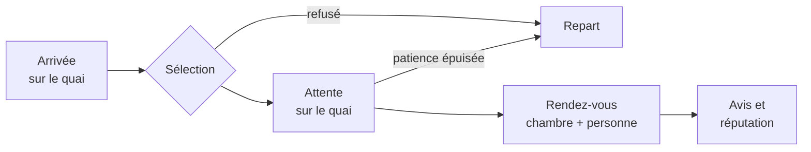
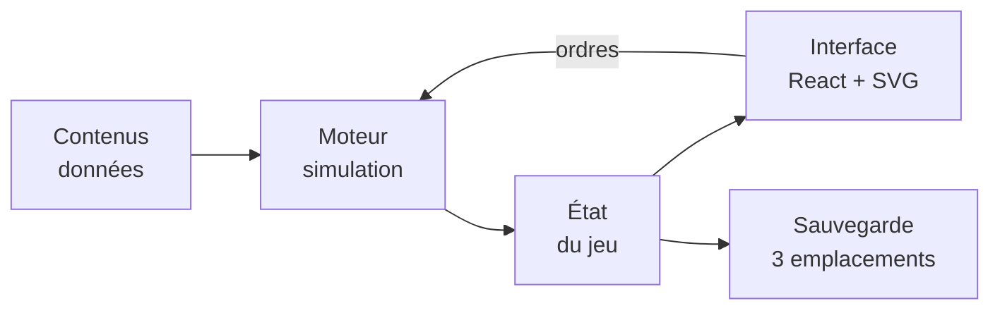

# La bonne passe — Spécifications v2

Source de vérité du projet. Version du 25 septembre 2026.

## Vision

*La bonne passe* est un jeu de gestion en temps réel sur téléphone : tu reprends une petite maison close à Amsterdam, presque vide, et tu la fais grandir jusqu'à un réseau dans plusieurs pays aux lois différentes. Le joueur est la direction : il fixe les règles, recrute, arbitre et gère les crises, pendant que la maison vit sous ses yeux.

### Piliers

1. **Diriger, pas exécuter.** Aucune affectation client par client. Chaque décision porte sur une règle, une personne ou un investissement, et ses effets se voient à l'écran.
2. **Partir de rien et grandir.** Chaque semaine de jeu ouvre quelque chose de neuf : personnel, pièces, équipes, clientèles, outils.
3. **Des arbitrages permanents.** Argent contre moral, affluence contre réputation, discrétion contre visibilité.
4. **Des gens, pas des chiffres.** Le personnel est au cœur du jeu, avec des personnalités, des ambitions et des histoires.
5. **Réaliste, glamour, décalé.** Des systèmes crédibles, un habillage chic et sensuel, de l'humour dans tous les textes.

### Cadre

- **Plateforme** : navigateur mobile, en paysage, jouable à deux pouces, installable sur l'écran d'accueil. Publié sur GitHub Pages depuis un dépôt public.
- **Sessions** : 15 à 20 minutes, actives. Aucune logique idle : le jeu n'avance que lorsqu'on joue.
- **Public** : adultes. Suggestif, jamais explicite.
- **Langue** : français uniquement.
- **Développement** : en vibe coding avec Claude Code, depuis un téléphone.

## Démarrage d'une partie

Une partie commence par le choix d'un emplacement de sauvegarde, puis par la création de son personnage. Le tout prend moins d'une minute.

### Écran titre et sauvegardes

- **3 emplacements** de partie, jouables en parallèle.
- Chaque emplacement affiche l'avatar, le prénom, le nom de la maison, le chapitre en cours, la date de jeu, la trésorerie et la date de dernière partie.
- Actions : Continuer, Nouvelle partie (sur un emplacement vide), Supprimer (avec confirmation).
- Sauvegarde automatique dans l'emplacement actif : à chaque fermeture de nuit, à chaque bilan et quand l'appli passe en arrière-plan.

### Création du personnage

1. **Avatar** : 6 avatars vectoriels, 3 patronnes et 3 patrons, de styles variés, plus une variante de tenue pour chacun. L'avatar apparaît dans les cartes (briefing, bilans, entretiens) et dans le bureau de la maison.
2. **Identité** : un prénom, obligatoire. Le jeu accorde ses textes selon l'avatar choisi (« la patronne » ou « le patron »).
3. **La maison** : le nom de la maison, affiché en néon sur la façade (*La bonne passe* par défaut). Les courriers de la banque, de la mairie et des impôts sont adressés à la maison.

Un filtre simple empêche les noms injurieux sur l'enseigne. Le nom de la maison reste modifiable une fois, au palier 4.

## Boucle de jeu

Le temps s'écoule en continu, avec pause et trois vitesses. À ×1, une soirée dure environ 6 minutes réelles ; ×2 (3 min) et ×4 (1 min 30) servent à accélérer. Un rendez-vous obligatoire rythme chaque journée : le briefing de 19 h, en pause.


Chaque lundi arrivent le bilan de la semaine et les décisions financières. Chaque fin de mois tombent la mensualité et l'évaluation de l'objectif.

### Les quatre temps d'une journée

| Temps | Durée réelle à ×1 | Rôle du joueur |
| --- | --- | --- |
| Journée (5 h – 19 h) | environ 45 s | Recrutements, entretiens, travaux, livraisons. Les rendez-vous de la journée (candidats, fournisseurs, visiteurs) mettent en pause. |
| Briefing (19 h) | en pause | Planning du soir, offre du soir, demandes en attente, achats. 3 à 5 décisions. |
| Soirée (ouverture – fermeture) | environ 6 min | Surveiller, réagir aux alertes, trancher les imprévus, ajuster les règles. |
| Fermeture | en pause, 1 écran | Bilan de la nuit : recettes, avis marquants, incidents, état du personnel. |

### Ce qui rend la soirée active

- **Des alertes avec délai** : chambre sale, bar vide, linge épuisé, dispute, employée à bout, VIP qui s'impatiente. Ignorée, une alerte a une conséquence.
- **Des imprévus à trancher** : environ 2 par soirée, en pause automatique. Dilemmes et opportunités.
- **Des ressources qui manquent** : personne ne peut tout couvrir, surtout au début.
- **Objectif de conception** : 6 à 10 décisions significatives par soirée.

### Les objectifs

- **Mensuels** : payer la mensualité, atteindre une réputation, fidéliser un segment.
- **Défis de la semaine** : « un congrès médical en ville : sauras-tu en profiter ? ».
- **Paliers** : le prochain palier de montée en puissance est toujours affiché.

## Campagne et fin de partie

La campagne se découpe en 4 chapitres, un par pays, et se termine par une vraie fin. Le premier chapitre est imposé à Amsterdam ; ensuite, le joueur choisit sur la carte l'ordre des pays suivants. Les lois sont simplifiées et un avertissement en jeu rappelle que tout est fictif.

### Les régimes

| Régime | Exemples | Ce qui change |
| --- | --- | --- |
| Légal | Pays-Bas, Allemagne, Belgique | Licence, impôts, inspections, droits du personnel. Concurrence forte, prix modérés. |
| Toléré | Espagne, Thaïlande | Zone grise. Façade et relations locales suffisent le plus souvent. |
| Client pénalisé | France, Suède | Les clients risquent l'amende : nerveux, ils paient pour la discrétion. |
| Interdit | Royaume-Uni, Italie | Jauge de chaleur, façade obligatoire, prix élevés, risque de descente. |

### La chaleur (régimes non légaux)

- Jauge de 0 à 100 par établissement. Elle monte avec l'affluence, la publicité, les incidents et les clients indiscrets.
- Elle descend avec le temps, la discrétion, une bonne façade et les appuis locaux.
- Paliers : surveillance à 70, descente probable à 90. Une descente coûte une amende, parfois la fermeture.

### Les chapitres

| Chapitre | Lieu | Objectif de fin de chapitre | Durée visée |
| --- | --- | --- | --- |
| 1. Les débuts | Amsterdam, imposé | Maison d'origine à réputation 70 et deuxième établissement ouvert | 6 à 8 h de jeu |
| 2. L'expansion | Pays toléré, au choix | Une maison rentable 4 semaines d'affilée | 4 à 5 h |
| 3. La discrétion | Pays à client pénalisé, au choix | Clientèle VIP fidélisée sans scandale | 4 à 5 h |
| 4. Le grand saut | Pays interdit, au choix | Tenir 8 semaines sous la barre de chaleur 70 | 5 à 6 h |

Chaque chapitre repart d'une petite maison, avec des paliers plus courts que le premier. Les maisons précédentes continuent de tourner, confiées à des gérantes.

### La fin

La campagne s'achève quand les 4 chapitres sont bouclés et l'emprunt de rachat remboursé. La fin déclenche le Grand Gala, une dernière soirée spéciale qui réunit les personnages marquants de la partie, puis un épilogue raconté par Madame Josée. Un écran récapitule la partie : durée, recettes totales, personnages restés fidèles, décisions marquantes, et un titre final selon le style de jeu (« Baronne du velours », « Roi de la discrétion »…).

### Après la fin : le mode libre

Le joueur peut continuer la même partie sans nouveau chapitre. Des objectifs simplifiés tournent chaque semaine, tirés au sort : une recette à atteindre, une semaine sans incident, un segment à reconquérir, un record à battre. Les intrigues continuent, mais plus aucun palier ne s'ouvre.

En version 1.0, seul le chapitre 1 est jouable, avec sa propre fin de chapitre et le mode libre.

## Montée en puissance

Le joueur part presque de rien : une hôtesse, une chambre en état, un salon et une personne au ménage. Le reste s'ouvre par paliers atteints en jouant. Les seuils sont à équilibrer après test (réputation sur 100).

| Palier | Déclencheur | Ce qui s'ouvre |
| --- | --- | --- |
| Départ | — | Sanne seule ; 1 chambre en état (Boudoir) sur 4, les autres sous des draps ; le salon et le bureau ; 1 personne au ménage. Onglets Maison, Personnel, Finances, Journal. Touristes et Habitués. |
| 1. Rouvrir | Première soirée bouclée | Recrutement, rénovation des chambres fermées, planning du soir, réserve de sécurité |
| 2. Se faire un nom | Réputation 25 | Bar et équipe Bar, onglet Clientèle, tarifs et formules, avance fournisseur, segments Affaires et Groupes |
| 3. Tenir la maison | Première mensualité payée | Équipes Accueil et Sécurité, soirées à thème, onglet Relations, première rivale qui réagit, emprunt, assurance |
| 4. Monter en gamme | Réputation 50 et 4 personnes | VIP et Couples curieux, formations, chambres de luxe (Jacuzzi) et niveaux de confort, placement, changement de nom de la maison |
| 5. S'agrandir | Réputation 70 et accord de la mairie | Agrandissement, jusqu'à 8 personnes, promotion en gérante, deuxième établissement |

- Environ un nouveau système par semaine de jeu, présenté par Josée à son ouverture.
- Le palier suivant est toujours affiché, avec ce qu'il rapporte.
- Un palier ouvre une possibilité, pas un cadeau : le joueur paie, choisit et construit lui-même.
- Chaque nouvel établissement repart petit, avec des paliers plus courts.

## Personnel

Le personnel est la priorité numéro un du jeu. Il combine des personnages suivis, avec nom et histoire, et des équipes gérées par effectif et par niveau.

### Personnages suivis

Les hôtesses et hôtes, puis les gérantes : 1 au départ, 4 au plus dans la maison d'origine, jusqu'à 8 une fois agrandie.

| Donnée | Valeurs | Effet |
| --- | --- | --- |
| Talents | Charme, Conversation, Audace, Discrétion (1 à 5) | Satisfaction selon ce que cherche le client. La discrétion compte pour les VIP et en pays non légal. |
| Fatigue | 0 à 100 | Monte à chaque rendez-vous, baisse au repos. Au-delà de 75 : qualité en baisse. |
| Moral | 0 à 100 | Baisse avec la fatigue, les conflits, les refus. Sous 20 : menace de départ. |
| Loyauté | 0 à 100 | Résiste au débauchage, pèse sur l'honnêteté d'une gérante. |
| Part reversée | 40 à 65 % | Ce que la personne garde sur chaque rendez-vous. Se négocie. |
| Traits | 2 par personne | Fêtarde, Ambitieuse, Diva, Mère poule, Solitaire, Tête brûlée, Fidèle… |
| Ambition | 1 par personne | Devenir gérante, financer ses études, ouvrir un salon de tatouage, partir à Ibiza. |

Les traits modifient les règles. Exemples : une Diva perd du moral tant qu'aucune chambre premium n'est ouverte ; une Mère poule remonte le moral des autres chaque nuit ; une Fêtarde attire les groupes mais se fatigue plus vite ; une Tête brûlée déclenche parfois des disputes.

### Relations entre employés

- Chaque paire a une affinité, de rivalité à amitié, qui évolue selon les soirées partagées et les événements.
- Les amitiés remontent le moral ; les rivalités créent des incidents (dispute, clients « volés », rumeurs).
- Le joueur peut organiser une médiation, en entretien avec les deux personnes.

### Actions du joueur

1. **Planning** : qui travaille quels soirs, décidé au briefing. Repos, congés, soirée spéciale, et le nombre maximum de rendez-vous par personne et par soir (2, 3 ou 4 : plus de recettes, plus d'usure).
2. **Entretien individuel** : écouter, promettre, recadrer. 2 ou 3 réponses, avec des effets sur le moral et la loyauté.
3. **Argent** : prime, part reversée, avance sur salaire.
4. **Évolution** : formations (langues, conversation, danse), promotion en gérante.
5. **Séparation** : licenciement, avec un coût en moral pour les autres et un risque de rumeurs.

### Recrutement

- Un marché renouvelé chaque lundi : 1 ou 2 candidats au début, jusqu'à 5 quand la réputation monte. Sources : petite annonce, bouche-à-oreille, débauchage chez un rival.
- L'entretien d'embauche est une carte : le joueur pose une question parmi deux, ce qui révèle un trait caché ; le reste se découvre en jouant. Il propose ensuite une part (45, 50 ou 55 %), peut réfléchir (le candidat reste en attente) ou refuser.
- Une période d'essai d'une semaine.

### Histoires personnelles

Chaque personnage porte un arc de 3 à 5 événements, déclenchés par son moral, son ambition ou le temps. Mener un arc à bien débloque un bonus : une gérante fidèle, un talent en plus, un contact utile.

### Équipes

| Équipe | Rôle | Coût indicatif | Ouverte au palier |
| --- | --- | --- | --- |
| Ménage | Propreté des chambres et du linge | 90 € par jour et par personne | Départ (1 personne) |
| Bar | Recettes annexes, ambiance du salon | 110 € | 2 |
| Accueil | Patience des clients, tri à l'entrée | 100 € | 3 |
| Sécurité | Prévention et règlement des incidents, discrétion | 130 € | 3 |

Chaque équipe a un effectif et un niveau (1 à 3), qui augmente par la formation. L'effectif fixe la capacité, le niveau la qualité. Le ménage nettoie environ trois fois plus vite quand la maison est fermée.

### Départ

Le joueur démarre avec Sanne seule (29 ans, Conversation 5, traits Mère poule et Fidèle), la dernière hôtesse de Madame Josée. Les premiers candidats scénarisés se présentent pendant la première semaine, et le joueur choisit qui embaucher et dans quel ordre :

- **Mila**, 26 ans, Charme 5, traits Diva et Ambitieuse, vient du Pink Palace (jour 2, 11 h).
- **Jonas**, 28 ans, polyvalent (Charme 4, Conversation 4, Discrétion 4), traits Solitaire et Fidèle (jour 2, 15 h).
- **Inès**, 31 ans, Audace 5, traits Tête brûlée et Fêtarde (jour 3, 11 h).

Tous sont adultes et travaillent de leur plein gré : ils peuvent refuser, négocier et partir.

## Clientèle et offre

La clientèle se découpe en segments aux attentes différentes, qui s'ouvrent par paliers. Les clients restent des individus visibles à l'écran, avec leurs répliques, mais le joueur n'agit que sur les segments et sur l'offre. Les clients sont répartis automatiquement par la maison.

### Segments

| Segment | Budget | Attend surtout | Sensible à | Palier |
| --- | --- | --- | --- | --- |
| Touristes | Faible à moyen | Conversation, ambiance | Prix, visibilité en ligne | Départ |
| Habitués | Moyen | Charme, fidélité à une personne | Départs du personnel, changements | Départ |
| Affaires | Moyen à élevé | Efficacité, audace | Attente, horaires | 2 |
| Groupes | Moyen, en nombre | Fête, bar | Sécurité, bruit (voisins) | 2 |
| VIP | Élevé | Discrétion, prestige | Incidents, indiscrétions, décor | 4 |
| Couples curieux | Moyen | Conversation, chambre à thème | Accueil, propreté | 4 |

Chaque segment a sa propre satisfaction, qui nourrit la réputation auprès de lui. La réputation globale est leur moyenne pondérée.

### Tendances

Chaque semaine, un ou deux contextes modifient la demande : un congrès médical (Affaires en hausse), un match européen (Groupes), la haute saison (Touristes), un scandale politique (VIP en retrait). Ils s'annoncent au briefing du lundi.

### Leviers d'offre

1. **Offre du soir**, choisie au briefing dès le départ : soirée classique, happy hour (prix −20 %, affluence +40 %), soirée feutrée (affluence −30 %, satisfaction en hausse).
2. **Tarifs** : un niveau général et un cran par chambre et par formule.
3. **Formules** : rendez-vous court, soirée complète, formule champagne, abonnement habitué.
4. **Soirées à thème** (palier 3), programmées au briefing : masquée, burlesque, jazz, années folles. Chacune coûte, attire un segment et fatigue plus ou moins.
5. **Sélection à l'entrée** : laxiste, normale, stricte, ou règles ciblées (« pas de groupes après minuit »).
6. **Priorité d'accueil** : ordre d'arrivée, VIP, habitués.
7. **Visibilité** : bouche-à-oreille, site discret, concierges d'hôtel, influenceurs. Plus de monde, mais en pays non légal, plus de chaleur.

### Déroulé d'une visite, automatique



La satisfaction dépend de la personne choisie par la maison, de la chambre (propreté, état, thème), du linge, du bar, de l'attente et de l'offre du soir. Pendant un rendez-vous, les rideaux de velours de la chambre se ferment et une barre de progression s'affiche.

## Relations et rivaux

La maison vit dans un quartier : chaque acteur extérieur a une jauge de relation de −100 à +100, qui ouvre des facilités ou déclenche des ennuis. L'onglet Relations s'ouvre au palier 3.

| Acteur | En bons termes | En mauvais termes |
| --- | --- | --- |
| Mairie | Licences, agrandissement autorisé | Inspections, refus de permis |
| Police | Tolérance, avertissements discrets | Contrôles, descentes (pays non légaux) |
| Voisins | Paix, témoins favorables | Plaintes, pétition, presse locale |
| Fournisseurs | Prix, livraisons fiables | Retards, ruptures de stock |
| Presse | Visibilité flatteuse | Scandale, fuite de VIP |

### Maisons rivales

- 2 ou 3 rivales par ville, chacune avec une patronne, un style et une stratégie. Exemples : *Le Chat Noir*, la maison chic qui débauche ; *Pink Palace*, l'usine à touristes qui casse les prix.
- Elles réagissent au joueur : baisse de prix, débauchage, rumeurs, voire sabotage (un faux client qui provoque un incident).
- Le joueur peut répondre : débaucher à son tour, lancer une rumeur, s'allier, ou racheter une rivale en difficulté.

### Actions de relations

Invitations, cadeaux, dons à une association du quartier, contributions « discrètes » là où elles se pratiquent, services rendus à un VIP. Chaque action a un coût et un risque, surtout en pays non légal.

## Aménagement et décor

L'aménagement sert surtout les autres systèmes : des pièces à thème dans une maison en coupe, que l'on rouvre, entretient, rénove et agrandit. La maison d'origine compte 4 chambres (Boudoir, Orientale, Velours, Miroirs), un salon, un bar et un bureau. Au départ, seuls le Boudoir, le salon et le bureau sont en service ; le reste dort sous des draps.

- **Chambres** : un thème, une propreté, un état et un niveau de confort. Velours et Miroirs sont premium. Le thème attire certains segments.
- **Pièces communes** : le salon (où le personnel attend), le bar (stock, recettes), les loges du personnel (récupération, moral) et le bureau, où apparaît l'avatar du joueur.
- **Actions** : rouvrir une chambre fermée (900 €, 8 h de travaux), nettoyage express (30 €), rafraîchir la déco (400 €, 6 h), changer de thème, fermer temporairement, améliorer d'un niveau.
- **Agrandissement** : racheter le bâtiment voisin ou un étage, ce qui ajoute 2 à 3 pièces, avec l'accord de la mairie (palier 5).
- **Usure** : chaque rendez-vous salit la chambre (environ −20 % de propreté) et l'use un peu. Sous 40 % : alerte ; sous 15 % : la chambre ne reçoit plus. Le ménage traite la propreté ; l'état demande une rénovation payante.
- **Linge** : chaque rendez-vous consomme 10 draps. Commande au briefing (50 draps, 60 €, livrés à l'ouverture) ou livraison express en soirée (90 €).

## Économie et finances

La gestion financière est complète mais simple à jouer : trois décisions au plus par semaine, prises au briefing du lundi, et tout le reste calculé par le jeu. Le joueur démarre endetté, après avoir racheté la maison à Madame Josée grâce à un emprunt. Tous les montants sont des points de départ à équilibrer.

### Postes

| Poste | Montant de départ | Rythme |
| --- | --- | --- |
| Trésorerie initiale | 3 000 € | une fois |
| Emprunt de rachat | 30 000 €, mensualité de 2 500 € | chaque 1er du mois (jour 28 pour le premier) |
| Charges fixes (énergie, assurance de base, licence) | 600 € | chaque lundi |
| Salaires des équipes | 90 à 130 € par personne | chaque jour à midi |
| Part du personnel | 40 à 65 % de chaque rendez-vous | à chaque rendez-vous |
| Recette d'un rendez-vous | 60 à 450 € selon client et tarifs | à chaque rendez-vous |
| Bar | 6 à 30 € par client | à chaque rendez-vous |

Cibles : une soirée correcte rapporte 600 à 1 000 € net à la maison, une excellente 2 000 €. Le premier mois se boucle si le joueur gère activement ; laisser faire mène à un léger déficit.

### Outils

| Outil | Ce que le joueur décide | Effet | Palier |
| --- | --- | --- | --- |
| Bilan du lundi | rien, il le lit | Recettes et dépenses par poste, résultat de la semaine, trésorerie projetée sur 4 semaines | Départ |
| Réserve de sécurité | 0, 10 ou 20 % de la recette du soir mis de côté | Couvre la mensualité ; y toucher hors urgence vaut une remarque de Josée | 1 |
| Tarifs et formules | 3 crans par chambre et par formule | ±20 % de recette par rendez-vous, effet inverse sur la demande selon le segment | 2 |
| Avance fournisseur | accepter ou refuser une offre du grossiste | 1 500 € de stock du bar sans payer, remboursés +10 % sous 2 semaines | 2 |
| Nouvel emprunt | montant par tranches de 5 000 € (jusqu'à 40 000 €), durée 6, 12 ou 24 mois | Taux de 4 à 9 % selon la réputation et les retards passés | 3 |
| Assurance | aucune, casse, ou casse + amendes | 80 à 200 € par semaine ; rembourse 70 à 100 % des sinistres couverts | 3 |
| Placement de l'excédent | une somme bloquée 4 semaines, prudent ou risqué | +2 % sûr, ou −5 à +8 % selon les contextes de la semaine | 4 |

### Règles automatiques

- Impôt trimestriel de 20 % du bénéfice, prélevé seul, annoncé 2 semaines avant par Josée.
- Découvert toléré jusqu'à −2 000 €, avec 1 % d'agios par jour.
- Au-delà, les salaires ne sont plus versés : moral en baisse, puis départs.
- Une mensualité impayée : lettre de la banque, adressée à la maison, et +2 points sur le taux du prochain emprunt. Deux mensualités impayées : faillite et fin de partie.

### Garde-fous de simplicité

- Chaque choix se fait en 2 à 4 crans, jamais en saisie libre.
- L'effet s'affiche avant de valider (« mensualité 1 150 €, dernière échéance en mois 14 »).
- Josée donne son avis en une phrase sur chaque décision.
- Le joueur peut confier la gestion à Josée : réserve à 10 %, jamais d'emprunt ni de placement. C'est prudent, mais légèrement déficitaire.
- Un outil s'ouvre à la fois, avec son palier.

## Événements et intrigues

Les événements sont le principal moteur de décision en soirée. Ils existent à trois échelles, et chacun laisse une trace dans les jauges ou dans l'histoire.

| Échelle | Fréquence visée | Forme | Exemples |
| --- | --- | --- | --- |
| Alerte | 4 à 8 par soirée | Bulle sur le bâtiment, délai, 1 ou 2 actions | Chambre sale, linge épuisé, bar vide, dispute sur le quai, employée épuisée |
| Imprévu | environ 2 par soirée | Carte en pause, 2 ou 3 choix | Touriste perdu, averse soudaine, voisin au sonomètre, inspection sanitaire, proposition de live, employée qui veut finir plus tôt, enterrement de vie de garçon |
| Intrigue | 1 ou 2 actives à la fois | Chaîne de 3 à 6 cartes sur plusieurs jours | Arc d'un personnage, rivale qui débauche, VIP qui propose un « arrangement » |

Les événements suivent la montée en puissance : au départ, ils concernent Sanne, la maison vide et les premiers candidats ; les rivales et les VIP n'entrent en scène qu'aux paliers correspondants. Le premier imprévu de la partie est toujours simple (le touriste perdu).

### Règles d'écriture

- **Pas de bonne réponse évidente.** Chaque choix gagne quelque chose et en perd une autre.
- **Des conséquences différées.** Un choix peut revenir des jours plus tard (« le voisin est revenu, avec un avocat »).
- **Des conditions de déclenchement** selon l'état du jeu : moral bas, réputation haute, rivale agressive, chaleur.
- **Autant d'opportunités que de problèmes** : un client généreux, une candidate star, un article flatteur.
- **Un ton décalé**, avec le prénom du joueur et le nom de sa maison dans les textes.

### Exemple d'intrigue : « L'offre du Chat Noir »

1. Mila est vue en train de boire un verre avec la patronne du Chat Noir.
2. Au briefing, elle demande 55 % de part. Accepter, refuser, ou lui parler.
3. Si son moral ou sa loyauté sont bas, elle reçoit une offre ferme sous 3 jours.
4. Le joueur peut contre-offrir, la laisser partir (et perdre ses habitués), ou riposter en débauchant chez le Chat Noir.
5. Dénouement : Mila reste plus loyale que jamais, ou devient une rivale récurrente.

## Didacticiel

Le didacticiel tient en une première soirée guidée, juste après la création du personnage (la partie commence alors à 18 h, pour laisser le temps de visiter), animée par Madame Josée : l'ancienne patronne, 68 ans, chignon gris, lunettes et perles, qui t'a vendu la maison et ne peut pas s'empêcher de passer. Chaque étape met une zone de l'écran en évidence (cadre lumineux) et attend une action. Un bouton permet de passer le didacticiel. Le temps est en pause pendant les explications.

1. **Accueil.** « Alors c'est toi, {prénom} ? La maison est à toi désormais. Enfin, à toi et à la banque. »
2. **La maison.** Une seule chambre en état, les autres sous des draps. Le joueur touche le Boudoir, sa fiche s'ouvre dans le panneau.
3. **Le personnel.** Le joueur ouvre l'onglet Personnel. « Sanne tient la maison seule depuis mon départ. Trouve-lui vite des collègues. »
4. **Le temps.** Présentation des vitesses ; le joueur lance le temps.
5. **Le briefing de 19 h.** Premier planning et choix de l'offre, avec un conseil de Josée.
6. **La première alerte.** À la première chambre sale, le jeu se met en pause ; le joueur touche la bulle puis lance un nettoyage express.
7. **Le premier imprévu**, puis le bilan de fermeture et le premier palier atteint. « Pas mal, pour un début. Je repasserai. »

Ensuite, Josée revient à chaque palier pour présenter le système qui s'ouvre, et quand une jauge devient critique. Chaque écran garde un bouton d'aide court.

## Interface et direction artistique

Le jeu se joue en paysage. L'écran principal montre la maison en coupe à gauche et un panneau de gestion permanent à droite : on voit la maison vivre pendant qu'on la gère. En portrait, un écran invite à tourner le téléphone.

### Écrans

| Zone | Contenu |
| --- | --- |
| Écran titre | Logo néon, 3 emplacements de sauvegarde, création de partie (avatars à gauche, champs à droite, aperçu de l'enseigne) |
| Barre du haut | Nom de la maison, ville et régime, trésorerie, réputation, heure et jour, ouvert ou fermé, vitesses |
| Scène, à gauche (environ 60 % de la largeur) | Maison en coupe, personnages animés, bulles d'alerte, montants flottants, enseigne au nom de la maison. Un appui sur une pièce ouvre sa fiche dans le panneau. |
| Panneau, à droite | Onglets Maison, Personnel, Clientèle, Finances, Relations, Journal. Fiches détaillées (chambre, personnage, bar, candidat) avec retour. Les onglets verrouillés s'affichent avec un cadenas et leur palier. |
| Fil d'actualité | En bas du panneau : dernier événement, un appui ouvre le journal |
| Cartes | Briefing sur deux colonnes (planning à gauche, offre et achats à droite), imprévus, entretiens d'embauche, bilans, paliers |
| Didacticiel | Carte de Madame Josée et cadre lumineux autour de l'élément à toucher |

Écran de référence : environ 844 × 390 pixels utiles. Zones tactiles d'au moins 40 pixels, aucune interaction au survol, marges de sécurité (encoche) respectées.

### Direction artistique

- **Palette** : bleu nuit de canal (#0E2229), velours bordeaux (#5C1530), rose néon (#FF4F8B), laiton (#D4A64A), crème (#F4DCC8).
- **Typographies** : Yellowtail pour le néon et les moments forts ; Jost pour toute l'interface.
- **Décor** : maison de canal élargie, en coupe, avec pignon à gradins et poutre de levage. 4 chambres sur deux étages, salon, bar et bureau au premier, façade (porte verte, vitrine rouge, enseigne néon) et quai pavé en bas, canal au pied. Cycle jour et nuit, néon qui grésille, reflet dans l'eau, maisons voisines aux fenêtres allumées. Pièces fermées sous des draps au départ.
- **Agrandissement** : le bâtiment voisin s'ajoute à droite ; on fait glisser la vue le long de la rue.
- **Personnages en vectoriel affiné** : silhouettes plus détaillées dans la scène (2 ou 3 poses : debout, assise, qui marche) et portraits plus soignés dans les fiches, avec 3 expressions (neutre, contente, fâchée).
- **Personnages générés par composition** : visage, coiffure, teint, tenue et accessoires sont des pièces combinables. Chaque nouveau candidat du marché est unique sans dessin supplémentaire.
- **Pudeur** : les rideaux de velours se ferment sur chaque rendez-vous.

## Ton et limites de contenu

Le jeu est sensuel et suggestif, jamais explicite. Il traite son sujet avec humour et un regard adulte, sans glorifier l'exploitation.

- **Ce qui est permis** : tenues de soirée et lingerie dans les illustrations, dialogues qui flirtent, sous-entendus, chambres à thème, ambiance feutrée, portes et rideaux qui se ferment.
- **Ce qui est exclu** : nudité, scènes sexuelles, tout personnage mineur ou d'apparence mineure. Tous les personnages ont 18 ans et plus, âge affiché.
- **Le personnel est libre** : il travaille volontairement, négocie, refuse et peut partir. Aucune mécanique de contrainte ou de traite, y compris dans les pays non légaux, où l'illégalité ne concerne que les autorités.
- **L'humour** passe par les situations, les répliques de clients et les cartes, sans clichés ethniques ou nationaux faciles.

## Architecture technique

La règle d'or : la simulation est un moteur TypeScript pur, sans accès à l'écran, et l'interface ne fait que l'afficher et lui envoyer des ordres.

### Pile

| Couche | Choix | Pourquoi |
| --- | --- | --- |
| Build | Vite + TypeScript | Rapide, simple, standard |
| Interface | React | Beaucoup d'écrans de gestion |
| État | Zustand | Léger, lisible |
| Scène | SVG piloté par React | Reprend le décor des prototypes |
| Tests | Vitest sur le moteur | Vérifier l'équilibrage et éviter les régressions |
| Déploiement | GitHub Actions vers GitHub Pages | Publication à chaque push sur main |
| Installation | PWA | Icône sur l'écran d'accueil, plein écran, hors ligne, orientation paysage imposée une fois installé |

### Découpage



- **Moteur** : avance le temps par pas fixes de 5 minutes de jeu, applique les règles, produit des événements. Hasard à graine fixe, pour pouvoir rejouer une partie à l'identique.
- **Contenus** : clients, candidats, traits, événements, intrigues et textes décrits en fichiers de données, pas en code. Ajouter une carte ne touche pas au moteur.
- **Paliers** : chaque système porte un drapeau « ouvert ou non » dans l'état du jeu ; l'interface masque ce qui n'est pas encore ouvert.
- **Animations** : les déplacements des personnages sont purement visuels et ne bloquent jamais la simulation.

### Sauvegardes

- 3 emplacements dans le localStorage, plus un index léger (avatar, noms, chapitre, date, trésorerie) pour afficher l'écran titre sans tout charger.
- Chaque sauvegarde porte un numéro de version, avec des fonctions de migration quand la structure évolue.
- Sauvegarde automatique à chaque fermeture de nuit, à chaque bilan et au passage en arrière-plan. Pas de sauvegarde manuelle en v1.
- Une exportation en fichier est envisagée plus tard.

### Langue

Français uniquement. Les textes restent dans des fichiers de données séparés du code, sans système de traduction.

### Organisation du dépôt

```
src/engine/     moteur (tick, systèmes, paliers, hasard)
src/content/    données et textes (clients, staff, événements)
src/ui/         écrans, panneau, cartes
src/scene/      maison SVG, personnages, animations
src/save/       sauvegardes et migrations
docs/           ces spécifications, notes d'équilibrage
prototype/      prototypes HTML de référence (visuel uniquement)
CLAUDE.md       consignes pour Claude Code
```

## Feuille de route

Le jeu se construit par versions jouables, chacune testable sur téléphone en fin d'étape.

| Version | Contenu | Question à valider |
| --- | --- | --- |
| v0.1 | Dépôt, moteur, déploiement ; écran titre, 3 sauvegardes, création du personnage ; une maison, une nuit complète avec Sanne seule, briefing, alertes de base | Les fondations tiennent-elles ? |
| v0.2 | Didacticiel, paliers 1 et 2, personnel complet : talents, traits, moral, planning, entretiens, recrutement | Gérer des gens est-il captivant ? |
| v0.3 | Clientèle : segments, tendances, offre, soirées à thème | L'offre change-t-elle vraiment la partie ? |
| v0.4 | Événements, 3 premières intrigues, bilans | Les soirées se renouvellent-elles ? |
| v0.5 | Relations et une maison rivale ; palier 3 | Le quartier vit-il ? |
| v0.6 | Aménagement, finances complètes, paliers 4 et 5 | La progression sur un mois est-elle motivante ? |
| v1.0 | Chapitre 1 complet avec sa fin, mode libre, didacticiel final, équilibrage | Une campagne d'Amsterdam aboutie |

Après la v1.0 : chapitres 2 à 4, chaleur, gérantes multi-maisons, Grand Gala et fin de campagne.

## Questions ouvertes

- [ ] Rythme : 6 minutes par soirée à ×1 convient-il ? À confirmer au test de la v0.1.
- [ ] Seuils des paliers (réputation 25, 50, 70) : à équilibrer en jeu.
- [ ] Durées visées des chapitres (6 à 8 h pour le premier) : réalistes pour des sessions de 15 à 20 minutes ?
- [ ] Pays des chapitres 2 à 4 : la liste proposée convient-elle ?
