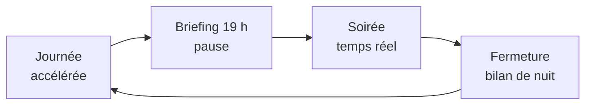
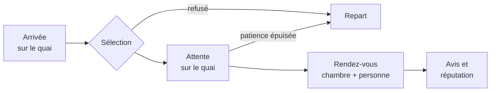
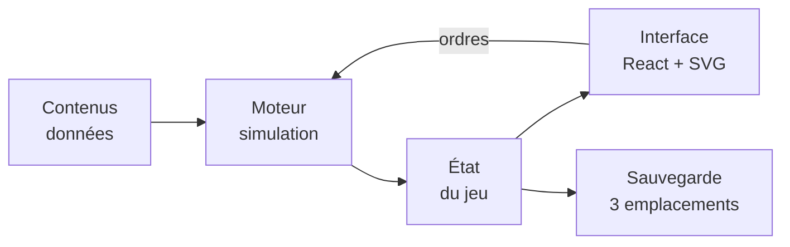

# La bonne passe — Spécifications v2

Source de vérité du projet. Version du 26 septembre 2026.

## Vision

*La bonne passe* est un jeu de gestion en temps réel sur téléphone : tu reprends une petite maison close à Amsterdam, presque vide, et tu la fais grandir jusqu'à un réseau dans plusieurs pays aux lois différentes. Le joueur est la direction : il fixe les règles, recrute, arbitre et gère les crises, pendant que la maison vit sous ses yeux.

### Piliers

1. **Diriger, pas exécuter.** Aucune affectation client par client. Chaque décision porte sur une règle, une personne ou un investissement, et ses effets se voient à l'écran.
2. **Partir de rien et grandir.** Chaque semaine de jeu ouvre quelque chose de neuf : personnel, pièces, équipes, clientèles, outils.
3. **Des arbitrages permanents.** Argent contre moral, affluence contre réputation, discrétion contre visibilité.
4. **Des gens, pas des chiffres.** Le personnel est au cœur du jeu, avec des personnalités, des ambitions et des histoires.
5. **Réaliste, glamour, décalé.** Des systèmes crédibles, un habillage chic et sensuel, de l'humour dans tous les textes.

### Cadre

- **Plateforme** : navigateur mobile, en paysage, jouable à deux pouces, installable sur l'écran d'accueil. Publié sur GitHub Pages depuis un dépôt public.
- **Sessions** : 15 à 20 minutes, actives. Aucune logique idle : le jeu n'avance que lorsqu'on joue.
- **Public** : adultes. Suggestif, jamais explicite.
- **Langue** : français uniquement.
- **Développement** : en vibe coding avec Claude Code, depuis un téléphone.

## Démarrage d'une partie

Une partie commence par le choix d'un emplacement de sauvegarde, puis par la création de son personnage. Le tout prend moins d'une minute.

### Écran titre et sauvegardes

- **3 emplacements** de partie, jouables en parallèle.
- Chaque emplacement affiche l'avatar, le prénom, le nom de la maison, le chapitre en cours, la date de jeu, la trésorerie et la date de dernière partie.
- Actions : Continuer, Nouvelle partie (sur un emplacement vide), Supprimer (avec confirmation).
- Sauvegarde automatique dans l'emplacement actif : à chaque fermeture de nuit, à chaque bilan et quand l'appli passe en arrière-plan.

### Création du personnage

1. **Avatar** : 6 avatars vectoriels, 3 patronnes et 3 patrons, de styles variés, plus une variante de tenue pour chacun. L'avatar apparaît dans les cartes (briefing, bilans, entretiens) et dans le bureau de la maison.
2. **Identité** : un prénom, obligatoire. Le jeu accorde ses textes selon l'avatar choisi (« la patronne » ou « le patron »).
3. **La maison** : le nom de la maison, affiché en néon sur la façade (*La bonne passe* par défaut). Les courriers de la banque, de la mairie et des impôts sont adressés à la maison.

Un filtre simple empêche les noms injurieux sur l'enseigne. Le nom de la maison reste modifiable une fois, au palier 4, dans la fiche du bureau, pour 500 € de nouvelle enseigne (v0.6).

## Boucle de jeu

Le temps s'écoule en continu, avec pause et trois vitesses. À ×1, une soirée dure environ 3 minutes réelles ; ×2 (1 min 30) et ×4 (45 s) servent à accélérer. La soirée est courte et intense : tout ce que le joueur doit faire à temps (alertes, disputes) lui laisse 10 à 30 secondes réelles à ×1, comme avant. Un rendez-vous obligatoire rythme chaque journée : le briefing de 19 h, en pause.


```mermaid
flowchart LR
  A[Journée<br/>accélérée] --> B[Briefing 19 h<br/>pause]
  B --> C[Soirée<br/>temps réel]
  C --> D[Fermeture<br/>bilan de nuit]
  D --> A
```

Chaque lundi arrivent le bilan de la semaine et les décisions financières. Chaque fin de mois tombent la mensualité et l'évaluation de l'objectif.

### Les quatre temps d'une journée

| Temps | Durée réelle à ×1 | Rôle du joueur |
| --- | --- | --- |
| Journée (5 h – 19 h) | environ 45 s | Recrutements, entretiens, travaux, livraisons. Les rendez-vous de la journée (candidats, fournisseurs, visiteurs) mettent en pause. |
| Briefing (19 h) | en pause | Planning du soir, offre du soir, demandes en attente, achats. 3 à 5 décisions. |
| Soirée (ouverture – fermeture) | environ 3 min | Surveiller, réagir aux alertes, trancher les imprévus, ajuster les règles. |
| Fermeture | en pause, 1 écran | Bilan de la nuit : recettes, avis marquants, incidents, état du personnel. |

### Ce qui rend la soirée active

- **Des alertes avec délai** : chambre sale, bar vide, linge épuisé, dispute, employée à bout, VIP qui s'impatiente. Ignorée, une alerte a une conséquence.
- **Des imprévus à trancher** : environ 2 par soirée, en pause automatique. Dilemmes et opportunités.
- **Des ressources qui manquent** : personne ne peut tout couvrir, surtout au début.
- **Objectif de conception** : 6 à 10 décisions significatives par soirée.

### Les objectifs

- **Mensuels** : payer la mensualité, atteindre une réputation, fidéliser un segment.
- **Défis de la semaine** : « un congrès médical en ville : sauras-tu en profiter ? ».
- **Paliers** : le prochain palier de montée en puissance est toujours affiché.

## Campagne et fin de partie

La campagne se découpe en 4 chapitres, un par pays, et se termine par une vraie fin. Le premier chapitre est imposé à Amsterdam ; ensuite, le joueur choisit sur la carte l'ordre des pays suivants. Les lois sont simplifiées et un avertissement en jeu rappelle que tout est fictif.

### Les régimes

| Régime | Exemples | Ce qui change |
| --- | --- | --- |
| Légal | Pays-Bas, Allemagne, Belgique | Licence, impôts, inspections, droits du personnel. Concurrence forte, prix modérés. |
| Toléré | Espagne, Thaïlande | Zone grise. Façade et relations locales suffisent le plus souvent. |
| Client pénalisé | France, Suède | Les clients risquent l'amende : nerveux, ils paient pour la discrétion. |
| Interdit | Royaume-Uni, Italie | Jauge de chaleur, façade obligatoire, prix élevés, risque de descente. |

### La chaleur (régimes non légaux)

- Jauge de 0 à 100 par établissement. Elle monte avec l'affluence, la publicité, les incidents et les clients indiscrets.
- Elle descend avec le temps, la discrétion, une bonne façade et les appuis locaux.
- Paliers : surveillance à 70, descente probable à 90. Une descente coûte une amende, parfois la fermeture.

### Les chapitres

| Chapitre | Lieu | Objectif de fin de chapitre | Durée visée |
| --- | --- | --- | --- |
| 1. Les débuts | Amsterdam, imposé | Deuxième établissement ouvert, et la maison d'origine à 70 de réputation au moins le soir où l'on vérifie (v1.0 : à chaque fermeture, une fois la deuxième maison inaugurée) | 6 à 8 h visées ; mesuré en v1.0 : 8 à 11 h à la vitesse courante (×2 le jour, ×1 le soir), 6 à 8 h à ×2 |
| 2. L'expansion | Pays toléré, au choix | Une maison rentable 4 semaines d'affilée | 4 à 5 h |
| 3. La discrétion | Pays à client pénalisé, au choix | Clientèle VIP fidélisée sans scandale | 4 à 5 h |
| 4. Le grand saut | Pays interdit, au choix | Tenir 8 semaines sous la barre de chaleur 70 | 5 à 6 h |

Chaque chapitre repart d'une petite maison, avec des paliers plus courts que le premier. Les maisons précédentes continuent de tourner, confiées à des gérantes.

### La fin

La campagne s'achève quand les 4 chapitres sont bouclés et l'emprunt de rachat remboursé. La fin déclenche le Grand Gala, une dernière soirée spéciale qui réunit les personnages marquants de la partie, puis un épilogue raconté par Madame Josée. Un écran récapitule la partie : durée, recettes totales, personnages restés fidèles, décisions marquantes, et un titre final selon le style de jeu (« Baronne du velours », « Roi de la discrétion »…).

### Après la fin : le mode libre

Le joueur peut continuer la même partie sans nouveau chapitre. Des objectifs simplifiés tournent chaque semaine, tirés au sort : une recette à atteindre, une semaine sans incident, un segment à reconquérir, un record à battre. Les intrigues continuent, mais plus aucun palier ne s'ouvre.

En v1.0, le mode libre commence le soir où le chapitre se boucle ; Josée le présente au bilan du lundi suivant. Chaque lundi, l'objectif de la semaine écoulée est jugé et un nouveau est tiré (avec son propre hasard, jamais deux fois le même d'affilée quand il y a le choix). Il remplace le défi de la semaine ; l'objectif du mois continue. L'onglet Maison le montre avec sa progression, le bilan du lundi dit s'il est réussi, la série en cours et le compte depuis la fin du chapitre.

| Objectif | Cible | Récompense |
| --- | --- | --- |
| Une belle semaine | La recette d'activité (rendez-vous, bar, divers ; sans la deuxième maison) des 4 dernières semaines en moyenne, +5 % | +1 de réputation |
| Une semaine sans histoire | Aucune dispute qui dégénère, aucune alerte manquée | +4 de moral pour l'équipe, +1 de réputation |
| Reconquérir | Le segment ouvert le moins content, s'il est sous 85, gagne 3 points de satisfaction dans la semaine | +4 de satisfaction pour lui |
| Battre un record | Une recette d'activité au-dessus de la meilleure des 4 dernières semaines | +5 de moral pour l'équipe, +2 de réputation |

En version 1.0, seul le chapitre 1 est jouable, avec sa propre fin de chapitre et le mode libre.

### La fin du chapitre 1 (v1.0)

- **La condition** : le soir, à la fermeture, la deuxième maison est ouverte (inaugurée, avec sa gérante) et la maison d'origine a au moins 70 de réputation. Le palier 5 en demande 80 : ce plancher pardonne une baisse pendant les mois chers de l'agrandissement, sans être acquis d'avance. Si la réputation est retombée, le chapitre se boucle le premier soir où elle remonte. Au palier 5, l'onglet Maison affiche cet objectif à la place du prochain palier.
- **La chronique** : pendant toute la partie, Josée retient ce qui compte (paliers, arrivées et départs, chambres rouvertes, bar, emprunts, mensualités impayées, sursis, dénouements des intrigues des personnages et du Chat Noir, agrandissement, gérance, achat et inauguration de la deuxième maison), les soirées par offre et par thème, les recettes de chaque semaine et le temps réel passé dans la partie (compté par l'interface, pauses comprises). Une partie d'avant la v1.0 commence sa chronique au chargement, avec les histoires déjà terminées ; Josée la présente.
- **L'écran de fin**, après le bilan de la nuit, raconté par Josée : la durée (jours de jeu et temps réel), les recettes totales, la réputation, les personnes restées fidèles (au moins 28 nuits, et la gérante de la deuxième maison si elle vient de l'équipe), celles parties en route, sept moments marquants (les grands tournants d'abord, dans l'ordre des jours), et un **titre selon le style de jeu**, accordé : Reine ou Roi de la discrétion (une majorité de soirées feutrées), Impératrice ou Empereur des nuits blanches (happy hours et thèmes), Bâtisseuse ou Bâtisseur du canal (le bâtiment voisin et six personnes), Mère ou Père de la maison (aucun départ), Funambule du découvert (une mensualité impayée), Baronne ou Baron du velours (90 de réputation), sinon Patronne ou Patron du quartier.
- **L'avertissement** : l'écran rappelle que tout est fiction, lois, lieux et personnages simplifiés ou inventés, et que chaque personne du jeu travaille librement. Une ligne le dit aussi en bas de l'écran titre.
- Le jeu continue ensuite dans la même partie (voir le mode libre). L'écran titre affiche « Chapitre 1 bouclé ».

## Montée en puissance

Le joueur part presque de rien : une hôtesse, une chambre en état, un salon et une personne au ménage. Le reste s'ouvre par paliers atteints en jouant. Les seuils sont à équilibrer après test (réputation sur 100).

| Palier | Déclencheur | Ce qui s'ouvre |
| --- | --- | --- |
| Départ | — | Sanne seule ; 1 chambre en état (Boudoir) sur 4, les autres sous des draps ; le salon et le bureau ; 1 personne au ménage. Onglets Maison, Personnel, Finances, Journal. Touristes et Habitués. |
| 1. Rouvrir | Première soirée bouclée | Recrutement, rénovation des chambres fermées, planning du soir, réserve de sécurité |
| 2. Se faire un nom | Réputation 25 | Segments Affaires et Groupes, onglet Clientèle, tarifs et formules, sélection à l'entrée et priorité d'accueil ; bar à rénover, puis équipe Bar et avance fournisseur ; soirées à thème et tendances au premier lundi ; buanderie au deuxième lundi (v1.0) |
| 3. Tenir la maison | Première mensualité payée | Onglet Relations (voisins, mairie, presse, police), première rivale qui réagit, équipes Accueil et Sécurité ; puis, lundi après lundi, l'assurance, la visibilité et le nouvel emprunt (v0.6) |
| 4. Monter en gamme | Réputation 60 et 4 personnes (50 avant la v0.6, partie 8) | VIP et Couples curieux, niveaux de confort des chambres (Jacuzzi dans les chambres premium), changement de nom de la maison ; puis, lundi après lundi, les formations et le placement (v0.6) |
| 5. S'agrandir | Réputation 80 et accord de la mairie (70 avant la v0.6, partie 8) | Le bâtiment voisin (2 ou 3 chambres) et jusqu'à 8 personnes ; puis, au lundi suivant, la gérance et le projet d'une deuxième maison (v1.0 ; un lundi chacun en v0.6) |

- Environ un nouveau système par semaine de jeu, présenté par Josée à son ouverture.
- Le palier suivant est toujours affiché, avec ce qu'il rapporte.
- Un palier ouvre une possibilité, pas un cadeau : le joueur paie, choisit et construit lui-même.
- Un palier riche s'ouvre par étapes : le palier 2 donne d'emblée la clientèle et les règles de la porte ; le bar se rouvre par des travaux, ce qui amène l'équipe Bar et l'offre du grossiste ; les soirées à thème arrivent au briefing du lundi suivant, avec les premières tendances ; la buanderie, au lundi d'après (v1.0, pour que la troisième semaine apporte du nouveau).
- Une partie qui a déjà passé un palier reçoit ce qu'une mise à jour y ajoute, présenté par Josée au chargement.
- Chaque nouvel établissement repart petit, avec des paliers plus courts.
- **Le palier 5 en v0.6** : au palier 4, avec 80 de réputation, le joueur dépose un dossier de permis dans la fiche de la mairie (onglet Relations, 300 €). La mairie répond au lundi suivant : elle accorde le permis si elle est en bons termes avec la maison (au-dessus de +40) et que la réputation tient ; sinon elle refuse et le joueur peut redéposer. Le permis accordé ouvre le palier 5 le jour même.
- **Le permis en trois étapes (v1.0)**, pour habiter les semaines 9 à 12. Le dossier s'ouvre au lundi où la maison du palier 4 a 70 de réputation, présenté par Josée. Le joueur le dépose (300 €) ; au lundi suivant commence l'**enquête de voisinage**, qui échoue si les voisins sont en mauvais termes (sous −40) : dossier refusé, à redéposer. Pendant l'enquête, une **réunion de quartier** (250 €, une fois) remonte les voisins de 12. Au lundi d'après, la **commission** accorde si la mairie est en bons termes (au-dessus de +40) et la réputation à 80 ; sinon elle ajourne d'une semaine, le dossier restant devant elle. Chaque étape est dans la fiche de la mairie et au journal.
- **Le deuxième établissement en v0.6 s'arrête au projet** : trois lieux proposés (tirés parmi cinq, prix à ±10 %, avec leur propre hasard), l'achat (29 000 à 53 000 €), puis les travaux (7 000 à 15 500 €, 5 à 10 jours). La maison attend ensuite sa gérante et son ouverture, qui viendront avec la v1.0 (fin du chapitre 1). L'achat et les travaux ont leur poste de dépenses, et n'entrent pas dans le bénéfice imposable (c'est un bien).
- **v1.0, partie 6 : on reprend un bail** (le fonds, la clientèle du quartier, les murs en location) au lieu de racheter les murs : 13 000 à 24 000 € selon le lieu, travaux 3 500 à 6 500 € en 4 à 7 jours. Le projet s'ouvre au même lundi que la gérance. Josée conseille la banque si la caisse ne suffit pas : le nouvel emprunt finance la reprise. Sans cela, le chapitre se bouclait vers le jour 200, trois mois d'épargne après le palier 5.
- **La deuxième maison ouvre en v1.0** et tourne seule, sans deuxième scène. Les travaux finis, Josée annonce qu'il lui faut quelqu'un pour la tenir ; tout se passe dans la fiche du bureau (une ligne de l'onglet Maison y mène) :
  - **sa gérante** : une personne de l'équipe, confirmée, avec au moins 10 nuits, qui ne laisse pas le salon vide et n'a pas d'intrigue en cours. Elle peut refuser (mêmes règles que la gérance) ; si elle accepte, elle quitte le salon pour de bon (ce n'est pas un départ), garde sa loyauté (+10 si c'était son rêve) et touche 110 € par soirée. Ou bien **Margot**, 46 ans, venue d'ailleurs, présentée par Josée : 150 € par soirée, loyauté 45, elle ne dégarnit pas l'équipe. Il y a désormais une gérante par maison ;
  - **l'inauguration** (1 500 €, une seule fois) ouvre la maison le soir même, avec une réputation de 30 (40 si la presse est en bons termes) ;
  - **chaque lundi, son bilan résumé** passe dans les comptes de la semaine (recette de la deuxième maison, et ses frais : charges, salaire de la gérante, incidents) et dans le bilan du lundi : soirées, rendez-vous, réputation, incident éventuel, et une phrase de la gérante. Sa réputation suit celle de la maison d'origine (80 %), les talents de la gérante et la consigne. Le bénéfice entre dans l'impôt ;
  - **une consigne par semaine**, qui vaut au lundi suivant : prudente (−15 % de monde, presque pas d'incident, réputation et loyauté montent), équilibrée, ou ambitieuse (+20 % de monde, un incident une semaine sur trois, réputation et loyauté s'usent) ;
  - **la gérante reste libre** : sous 40 de loyauté, 5 % de la recette disparaît de la caisse ; sous 20, elle rend ses clés au lundi, et la maison ferme en attendant quelqu'un d'autre. Margot partie ne revient pas. On peut aussi rappeler la gérante au salon (s'il y a de la place, −10 de moral) ou mettre fin au contrat de Margot ; la maison rouvre sans nouvelle inauguration ;
  - chaque lieu se rembourse (reprise du bail, travaux, inauguration) en 4 à 5 mois (v1.0, partie 6 ; 7 à 8 mois quand on rachetait les murs).
  - **Gardé pour après la v1.0** : sa scène, son équipe et son planning, ses relations et sa rivale, les transferts de personnel entre maisons, plusieurs gérantes à suivre, le rachat d'une rivale, la revente de la maison en cas de coup dur, et la chaleur.

## Personnel

Le personnel est la priorité numéro un du jeu. Il combine des personnages suivis, avec nom et histoire, et des équipes gérées par effectif et par niveau.

### Personnages suivis

Les hôtesses et hôtes, puis les gérantes : 1 au départ, 4 au plus dans la maison d'origine, jusqu'à 8 une fois agrandie.

| Donnée | Valeurs | Effet |
| --- | --- | --- |
| Talents | Charme, Conversation, Audace, Discrétion (1 à 5) | Satisfaction selon ce que cherche le client. La discrétion compte pour les VIP et en pays non légal. |
| Fatigue | 0 à 100 | Monte à chaque rendez-vous, baisse au repos. Au-delà de 75 : qualité en baisse. |
| Moral | 0 à 100 | Baisse avec la fatigue, les conflits, les refus. Sous 20 : menace de départ. |
| Loyauté | 0 à 100 | Résiste au débauchage, pèse sur l'honnêteté d'une gérante. |
| Part reversée | 40 à 65 % | Ce que la personne garde sur chaque rendez-vous. Se négocie. |
| Traits | 2 par personne | Fêtarde, Ambitieuse, Diva, Mère poule, Solitaire, Tête brûlée, Fidèle… |
| Ambition | 1 par personne | Devenir gérante, financer ses études, ouvrir un salon de tatouage, partir à Ibiza. |

Les traits modifient les règles. Exemples : une Diva perd du moral tant qu'aucune chambre premium n'est ouverte ; une Mère poule remonte le moral des autres chaque nuit ; une Fêtarde attire les groupes mais se fatigue plus vite ; une Tête brûlée déclenche parfois des disputes.

### Relations entre employés

- Chaque paire a une affinité, de rivalité à amitié, qui évolue selon les soirées partagées et les événements.
- Les amitiés remontent le moral ; les rivalités créent des incidents (dispute, clients « volés », rumeurs).
- Le joueur peut organiser une médiation, en entretien avec les deux personnes.

### Actions du joueur

1. **Planning** : qui travaille quels soirs, décidé au briefing. Repos, congés, soirée spéciale, et le nombre maximum de rendez-vous par personne et par soir (v0.6 : 2 à 6, 4 par défaut ; plus de recettes, plus d'usure).
   - Un rendez-vous fatigue d'environ 14,5 points, et une journée de repos en rend 64. Au briefing, chaque personne affiche sa fatigue attendue en fin de nuit au cran choisi, en comptant la fatigue déjà là, la Fêtarde, la formule et le thème (« fin de nuit ≈ 87 % : épuisée, pas remise demain »). À 5, c'est tout juste tenable ; à 6, on dépasse l'épuisement (80) et la personne n'est pas remise le lendemain.
   - Au-delà de 4 rendez-vous dans la nuit, chacun coûte 7 points de moral de plus.
   - Au cran 6, une personne fatiguée (30 et plus au briefing) ou au moral bas (sous 50) peut refuser (elle s'arrête à 5) ou négocier : une prime de 60 €, ou un soir de repos promis dans les 3 jours (une promesse rompue coûte comme à l'entretien). Sa réponse s'affiche au briefing, avec une réplique selon ses traits, et le joueur accepte ou la laisse à 5. Les traits pèsent : une Diva ou une Solitaire dit plus souvent non, une Fêtarde ou une Fidèle plus rarement.
2. **Entretien individuel** : écouter, promettre, recadrer. 2 ou 3 réponses, avec des effets sur le moral et la loyauté.
3. **Argent** : prime, part reversée, avance sur salaire.
4. **Évolution** : formations (langues, conversation, danse), promotion en gérante.

**La gérance (v0.6)**, au lundi qui suit le palier 5, dans la fiche de chaque personne confirmée ayant au moins 10 nuits dans la maison. La personne peut refuser : elle accepte si c'est son ambition (+15 de moral), ou si sa loyauté (50 et plus) ou son moral (60 et plus) le permettent. Une seule gérante par maison (la deuxième maison a la sienne en v1.0). Elle ne reçoit plus et sort du planning ; elle touche 110 € par jour à midi, avec les salaires. En échange : elle règle seule 35 % des alertes du quartier (20 % avant la v1.0, partie 6 ; en plus des équipes, même sans elles), chaque rendez-vous fatigue l'équipe 20 % de moins, le moral de chacun remonte de 2 par nuit (jusqu'à 80), et elle met au repos avant l'ouverture qui dépasse 70 de fatigue. Sous 40 de loyauté, la caisse perd chaque nuit 3 % de la recette de la maison, sur une ligne du bilan (« Caisse qui ne tombe pas juste »). On peut la rendre au salon (−10 de moral).
5. **Séparation** : licenciement, avec un coût en moral pour les autres et un risque de rumeurs.

### Recrutement

- Un marché renouvelé chaque lundi : 1 ou 2 candidats au début, jusqu'à 5 quand la réputation monte. Sources : petite annonce, bouche-à-oreille, débauchage chez un rival.
- L'entretien d'embauche est une carte : le joueur pose une question parmi deux, ce qui révèle un trait caché ; le reste se découvre en jouant. Il propose ensuite une part (45, 50 ou 55 %), peut réfléchir (le candidat reste en attente) ou refuser.
- Une période d'essai d'une semaine.

### Histoires personnelles

Chaque personnage porte un arc de 3 à 5 événements, déclenchés par son moral, son ambition ou le temps. Mener un arc à bien débloque un bonus : une gérante fidèle, un talent en plus, un contact utile.

En v1.0, les quatre personnages de départ ont le leur :

- **Mila, « La tête d'affiche »** (v0.4, vers la deuxième semaine) : elle peut devenir Tête d'affiche, ou partir.
- **Jonas, « Les examens »** (v0.4, vers la troisième semaine) : il peut devenir Juriste.
- **Inès, « Une saison à Ibiza »** (v1.0, après sa trentième nuit, vers les jours 36 à 42) : un flyer d'Ibiza, une fête sur le quai, puis son choix. Soutenue (moral de 50 et au moins un geste pour elle), elle reste : Oiseau de nuit (elle attire les groupes comme une Fêtarde, sans s'épuiser : elle n'est plus Fêtarde), ou assagie (Charme +1, elle n'est plus Tête brûlée). Sinon elle part, libre ; une contre-offre à 55 % la retient six fois sur dix.
- **Sanne, « La relève »** (v1.0, au palier 4, pas avant le jour 55) : le carnet de Josée, une soirée qu'elle tient seule, puis la visite de Josée. Préparée et de bon moral, elle devient **Pilier**, une gérante née : à la gérance, ses rotations fatiguent l'équipe 30 % de moins (20 % d'ordinaire), elle règle 10 % d'alertes en plus et ne pioche jamais dans la caisse ; à la tête de la deuxième maison, elle rapporte 5 % de plus.

### Équipes

| Équipe | Rôle | Coût indicatif | Ouverte au palier |
| --- | --- | --- | --- |
| Ménage | Propreté des chambres et du linge | 110 € par jour et par personne | Départ (1 personne) |
| Bar | Recettes annexes, ambiance du salon, patience sur le quai (le bar se rouvre d'abord : 1 200 €, 8 h de travaux) | 130 € | 2 |
| Accueil | Patience des clients, tri à l'entrée | 70 € (100 € avant le rééquilibrage de la v0.5) | 3 |
| Sécurité | Prévention et règlement des incidents, discrétion | 90 € (130 € avant le rééquilibrage de la v0.5) | 3 |

Chaque équipe a un effectif et un niveau (1 à 3), qui augmente par la formation. L'effectif fixe la capacité, le niveau la qualité. Le ménage nettoie environ trois fois plus vite quand la maison est fermée.

Formations (v0.6) : au lundi qui suit le palier 4, chaque équipe (ménage, bar, accueil, sécurité) passe du niveau 1 au niveau 2 pour 800 €, puis au niveau 3 pour 1 600 €, dans l'onglet Personnel et la fiche du bar. Par niveau au-dessus du premier : le ménage nettoie et lave 25 % plus vite ; le bar gagne 0,02 de qualité et 10 % de recette ; l'accueil et la sécurité règlent 10 points d'alertes de plus, et l'accueil ajoute 25 % de patience. Les formations individuelles (langues, danse) viendront plus tard.

En v0.5, Accueil et Sécurité s'ouvrent au palier 3, au niveau 1 (les formations viendront au palier 4), de 0 à 2 personnes chacune, dans l'onglet Personnel. Chaque personne règle seule, dès son apparition, environ 30 % des alertes de son domaine : clients pressés et groupes bruyants pour l'Accueil ; clients éméchés, photographes, faux clients et disputes pour la Sécurité. L'Accueil ajoute 12 minutes de patience sur le quai par personne ; la Sécurité fait baisser le ton (−20 % de disputes par personne), rassure les clients d'affaires et tient la porte stricte à la place du portier. De l'argent contre de l'attention, sans vider la soirée.

### Départ

Le joueur démarre avec Sanne seule (29 ans, Conversation 5, traits Mère poule et Fidèle), la dernière hôtesse de Madame Josée. Les premiers candidats scénarisés se présentent pendant la première semaine, et le joueur choisit qui embaucher et dans quel ordre :

- **Mila**, 26 ans, Charme 5, traits Diva et Ambitieuse, vient du Pink Palace (jour 2, 11 h).
- **Jonas**, 28 ans, polyvalent (Charme 4, Conversation 4, Discrétion 4), traits Solitaire et Fidèle (jour 2, 15 h).
- **Inès**, 31 ans, Audace 5, traits Tête brûlée et Fêtarde (jour 3, 11 h).

Tous sont adultes et travaillent de leur plein gré : ils peuvent refuser, négocier et partir.

**Le quartier en parle** (v0.6, partie 8) : pendant quatre semaines après chaque départ, le marché du lundi compte deux candidats de moins, et chaque candidat demande 5 points de part en plus (10 au plus). L'onglet Personnel le dit. User l'équipe et la remplacer ne devient pas une stratégie : au cran 6 permanent, la maison est devant au bout d'un mois, puis se vide et finit loin derrière au troisième.

## Clientèle et offre

La clientèle se découpe en segments aux attentes différentes, qui s'ouvrent par paliers. Les clients restent des individus visibles à l'écran, avec leurs répliques, mais le joueur n'agit que sur les segments et sur l'offre. Les clients sont répartis automatiquement par la maison.

### Segments

| Segment | Budget | Attend surtout | Sensible à | Palier |
| --- | --- | --- | --- | --- |
| Touristes | Faible à moyen | Conversation, ambiance | Prix, visibilité en ligne | Départ |
| Habitués | Moyen | Charme, fidélité à une personne | Départs du personnel, changements | Départ |
| Affaires | Moyen à élevé | Efficacité, audace | Attente, horaires | 2 |
| Groupes | Moyen, en nombre | Fête, bar | Sécurité, bruit (voisins) | 2 |
| VIP | Élevé | Discrétion, prestige | Incidents, indiscrétions, décor | 4 |
| Couples curieux | Moyen | Conversation, chambre à thème | Accueil, propreté | 4 |

Chaque segment a sa propre satisfaction, qui nourrit la réputation auprès de lui. La réputation globale est leur moyenne pondérée (les habitués pèsent un peu plus). Un segment content revient plus souvent ; un segment s'ouvre avec la réputation déjà acquise. L'onglet Clientèle (palier 2) montre, pour chaque segment, sa satisfaction, sa fréquentation des 7 dernières nuits, son budget, ce qu'il attend, ce qui le fâche et ce qui l'attire.

### Tendances

Chaque semaine, un ou deux contextes modifient la demande : un congrès médical (Affaires en hausse), un match européen (Groupes), la haute saison (Touristes), un scandale politique (VIP en retrait). Ils s'annoncent au briefing du lundi. Ils s'ouvrent au premier lundi après le palier 2, ne concernent que des segments ouverts, et certains creusent la demande (grève des trains, contrôles de police) : c'est alors l'offre, pas le prix, qui fait la différence. Josée les présente dans le bilan du lundi et au briefing, avec un conseil.

### Leviers d'offre

1. **Offre du soir**, choisie au briefing dès le départ : soirée classique, happy hour (prix −20 %, affluence +40 %), soirée feutrée (affluence −30 %, satisfaction en hausse).
2. **Tarifs** : un niveau général en 3 crans (−20 %, normal, +20 %). Pas de tarif par chambre : trop de réglages pour un écran de téléphone.
3. **Formules** : rendez-vous court et soirée complète (palier 2), formule champagne (bar ouvert) ; abonnement habitué plus tard. Une seule formule proposée à la fois ; le maximum de rendez-vous par personne se compte en charge (un court compte moins, une soirée complète plus).
4. **Soirées à thème** (palier 2, au premier lundi), programmées au briefing pour le soir même : masquée (affaires), burlesque (bouche-à-oreille, groupes et touristes), jazz (habitués, calme), années folles (bar). Chacune coûte, se paie par un supplément sur chaque rendez-vous, attire un segment et fatigue plus ou moins. Un même thème répété dans la semaine lasse : ses effets diminuent de moitié à chaque reprise.
5. **Sélection à l'entrée** (palier 2) : laxiste, normale, stricte (un portier payé à la soirée, qui refuse une partie des groupes et des touristes). Les règles ciblées (« pas de groupes après minuit ») viendront avec l'équipe Accueil.
6. **Priorité d'accueil** (palier 2) : ordre d'arrivée, habitués d'abord, pressés d'abord ; VIP d'abord au palier 4 (un peu plus de qualité pour eux).

VIP et Couples curieux (v0.6) arrivent au palier 4 avec une satisfaction égale à la réputation acquise. Les VIP paient 380 à 450 €, attendent mal, se soucient peu du prix, veulent une chambre premium (+0,05, −0,05 sinon) et un décor refait, et chaque incident (dispute qui dégénère, photographe manqué) coûte 3 points de leur satisfaction. Les couples paient 200 à 240 €, aiment les décors refaits (+0,04) et fuient les chambres sous 70 % de propreté. Ils restent rares : environ un client sur dix au deuxième mois. Leurs tendances (scandale politique…) viendront plus tard.
7. **Visibilité** (v0.5, avec les relations et la presse) : bouche-à-oreille, site discret, concierges d'hôtel, influenceurs. Plus de monde, mais en pays non légal, plus de chaleur. Elle s'ouvre au deuxième lundi après le palier 3, dans les règles de la maison, et se paie à chaque soirée ouverte (0, 30, 50 ou 40 €). Elle ne rapporte que si la maison a de la place : une soirée feutrée y gagne, une maison déjà pleine y perd. Le site discret attire clients d'affaires et habitués ; les concierges, clients d'affaires et touristes aisés (et la mairie apprécie) ; les influenceurs, beaucoup de touristes et de groupes : la presse adore, les voisins et les clients discrets beaucoup moins, et les photographes rôdent.

### Déroulé d'une visite, automatique


```mermaid
flowchart LR
  A[Arrivée<br/>sur le quai] --> B{Sélection}
  B -->|refusé| X[Repart]
  B --> C[Attente<br/>sur le quai]
  C -->|patience épuisée| X
  C --> D[Rendez-vous<br/>chambre + personne]
  D --> E[Avis et<br/>réputation]
```

La satisfaction dépend de la personne choisie par la maison, de la chambre (propreté, état, thème), du linge, du bar, de l'attente et de l'offre du soir. Pendant un rendez-vous, les rideaux de velours de la chambre se ferment et une barre de progression s'affiche.

## Relations et rivaux

La maison vit dans un quartier : chaque acteur extérieur a une jauge de relation de −100 à +100, qui ouvre des facilités ou déclenche des ennuis. L'onglet Relations s'ouvre au palier 3.

| Acteur | En bons termes | En mauvais termes |
| --- | --- | --- |
| Mairie | Licences, agrandissement autorisé | Inspections, refus de permis |
| Police | Tolérance, avertissements discrets | Contrôles, descentes (pays non légaux) |
| Voisins | Paix, témoins favorables | Plaintes, pétition, presse locale |
| Fournisseurs | Prix, livraisons fiables | Retards, ruptures de stock |

Les fournisseurs (v0.6) rejoignent les relations au lundi qui suit l'ouverture du nouvel emprunt : en bons termes, le linge, le bar et les livraisons express coûtent 10 % de moins ; en mauvais termes, 15 % de plus, et une livraison express sur trois n'arrive pas. Ils aiment les commandes régulières du briefing et l'avance du grossiste rendue à temps ; les salaires impayés et les mensualités en retard les font fuir. Deux actions (régler les factures d'avance, négocier les prix autour d'un genièvre) et deux cartes (la tournée du blanchisseur, la rupture de linge).
| Presse | Visibilité flatteuse | Scandale, fuite de VIP |

### Les relations à Amsterdam (v0.5)

- **Quatre acteurs** au palier 3 : voisins, mairie, presse, police. Les fournisseurs les rejoignent avec les finances complètes (v0.6), quelques semaines plus tard.
- **Seuils** : en bons termes au-dessus de +40, en mauvais termes sous −40. Départ : voisins +10, mairie +10 (les souvenirs de Josée), presse 0, police +5.
- **Ce qui les fait bouger** : les voisins jugent chaque nuit d'après le tapage ; une nuit très bruyante fait venir la police ; des voisins fâchés écrivent à la mairie ; la presse suit la réputation ; toutes reviennent doucement vers leur point d'équilibre. Les imprévus, les intrigues et les alertes manquées (photographe, groupe bruyant) les touchent aussi.
- **Ce qu'ils changent** : voisins en bons termes, le tapage monte moins vite ; mairie en bons termes, plus d'inspection sanitaire à l'improviste ; la presse fait varier la venue des touristes (jusqu'à ±15 %) ; police en bons termes, une dispute qui dégénère ne coûte plus de réputation.
- **Événements du quartier** : un acteur en bons ou en mauvais termes se manifeste de temps en temps, par une carte (fête des voisins ou pétition, conseil de l'échevin ou inspection surprise, portrait ou fuite dans la presse, tuyau de l'agent de quartier ou contrôle devant la porte).
- **Actions** : deux par acteur, une par semaine et par acteur, dans l'onglet Relations, avec leur coût, leur effet et l'avis de Josée ; certaines ont un risque.
- Avant le palier 3, les cartes font déjà bouger les jauges, en silence.

### Maisons rivales

- 2 ou 3 rivales par ville, chacune avec une patronne, un style et une stratégie. Exemples : *Le Chat Noir*, la maison chic qui débauche ; *Pink Palace*, l'usine à touristes qui casse les prix.
- Elles réagissent au joueur : baisse de prix, débauchage, rumeurs, voire sabotage (un faux client qui provoque un incident).
- Le joueur peut répondre : débaucher à son tour, lancer une rumeur, s'allier, ou racheter une rivale en difficulté.

### Le Chat Noir (v0.5)

- **La première rivale d'Amsterdam** : Le Chat Noir, maison chic de l'autre côté du canal, tenue par Colette Vos (54 ans, ancienne meneuse de revue). Elle vise les habitués et les clients d'affaires. Son enseigne apparaît sur la façade voisine au palier 3 ; au palier 2, quelques clients en parlent déjà.
- **Chaque lundi**, à partir du premier lundi après le palier 3 (où elle se présente par une carte de visite), son agressivité (0 à 100) se rapproche d'une cible qui monte avec la réputation de la maison et sa part d'habitués et de clients d'affaires. Plus elle est agressive, plus elle agit : prix cassés (habitués et clients d'affaires viennent moins jusqu'au lundi suivant), rumeur, faux client qui fait un scandale un soir (une alerte), débauchage (l'intrigue « L'offre du Chat Noir »). En bons rapports avec toi, elle propose parfois un échange de bons procédés.
- **Tes réponses**, une par semaine, dans sa fiche de l'onglet Relations : débaucher chez elle (une recrue douée et exigeante attend au salon), lancer une rumeur (ses clients viennent chez toi cette semaine, ou la presse s'en mêle), proposer une trêve (deux semaines de paix, acceptée plus volontiers quand vos rapports sont bons). Le rachat d'une rivale en difficulté viendra avec le deuxième établissement.
- Le bilan du lundi dit ce qu'elle prépare, sauf un débauchage, qui se découvre.

### Actions de relations

Invitations, cadeaux, dons à une association du quartier, contributions « discrètes » là où elles se pratiquent, services rendus à un VIP. Chaque action a un coût et un risque, surtout en pays non légal.

## Aménagement et décor

L'aménagement sert surtout les autres systèmes : des pièces à thème dans une maison en coupe, que l'on rouvre, entretient, rénove et agrandit. La maison d'origine compte 4 chambres (Boudoir, Orientale, Velours, Miroirs), un salon, un bar et un bureau. Au départ, seuls le Boudoir, le salon et le bureau sont en service ; le reste dort sous des draps.

- **Chambres** : un thème, une propreté, un état et un niveau de confort. Velours et Miroirs sont premium. Le thème attire certains segments.
- **Pièces communes** : le salon (où le personnel attend), le bar (stock, recettes), les loges du personnel (récupération, moral) et le bureau, où apparaît l'avatar du joueur.
- **Actions** : rouvrir une chambre fermée (900 €, 8 h de travaux), nettoyage express (30 €), rafraîchir la déco (400 €, 6 h), changer de thème, fermer temporairement, améliorer d'un niveau.
- **En v0.6**, dans la fiche de chaque chambre ouverte (dès le palier 1) :
  - rafraîchir la déco (400 €, 6 h) : la chambre ne reçoit pas pendant les travaux, puis son état remonte à 90 % ;
  - refaire le décor (600 €, 8 h), en 4 styles : rose poudré (touristes), orientale (groupes), velours (habitués), miroirs (clients d'affaires). Les décors d'origine, défraîchis, ne donnent rien ; refait à neuf, un décor ajoute 0,06 de qualité aux clients de son segment. On peut refaire à neuf le décor d'origine ;
  - fermer pour l'instant, et rouvrir : une chambre fermée ne reçoit plus, ne s'use plus et ne donne plus l'alerte ;
  - améliorer le confort (palier 4, v0.6) : niveau 1 au départ ; niveau 2 « Soigné » (1 500 €, 12 h), niveau 3 « Jacuzzi » (3 500 €, 24 h, chambres premium seulement, avec un jacuzzi dessiné dans la scène). Chaque niveau au-dessus du premier ajoute 0,04 de qualité à tous les clients et 10 % au prix du rendez-vous ; le jacuzzi ajoute 0,06 de qualité aux VIP et aux couples. Des étoiles marquent le niveau sur la porte.
- **Pièces annexes** (v0.6), à aménager par des travaux, visibles dans la maison en coupe et l'onglet Maison :
  - la buanderie (palier 2, 1 200 €, 8 h), derrière la fenêtre de droite du rez-de-chaussée ;
  - les loges du personnel (palier 3, 1 500 €, 10 h), sous les combles, derrière l'œil-de-bœuf. On s'y repose : récupération doublée entre deux clients, +25 % les soirs de repos, et le moral remonte seul jusqu'à 70 au lieu de 60.
- **Agrandissement** : racheter le bâtiment voisin ou un étage, ce qui ajoute 2 à 3 pièces, avec l'accord de la mairie (palier 5).
  - En v0.6 : le bâtiment voisin, étroit, à droite de la maison ; le Chat Noir s'éloigne d'une maison. Deux choix dans sa fiche (le toucher dans la scène, ou l'onglet Maison) : ses deux étages (14 000 €, 3 jours de travaux : l'Atelier, premium, et la chambre du canal) ou tout le bâtiment (22 000 €, 5 jours : la chambre du jardin en plus). Après les étages, le rez-de-chaussée peut suivre (9 000 €, 2 jours). Les chambres arrivent meublées, décor refait, confort 1.
  - Une fois agrandie, la maison peut accueillir jusqu'à 8 personnes (au salon, sur huit places plus serrées).
  - Dans la scène, un bouton « Chez le voisin › » fait glisser la vue le long de la rue (et « ‹ La maison » la ramène) ; il porte un point rose quand une chambre de l'autre côté réclame le ménage. Toucher une chambre dans le panneau y conduit la vue.
- **Usure** : chaque rendez-vous salit la chambre (environ −20 % de propreté) et l'use un peu. Sous 40 % : alerte ; sous 15 % : la chambre ne reçoit plus. Le ménage traite la propreté ; l'état demande une rénovation payante.
  - v0.6, partie 8 : 0,6 à 1,2 point d'état par rendez-vous, soit environ un mois à trois rendez-vous par nuit entre un rafraîchissement (90 %) et 30 %. Sous 30 % d'état, la chambre est **défraîchie** : chaque rendez-vous s'y paie 15 % de moins (la personne garde sa part du prix payé). La fiche de la chambre le dit. Le Boudoir démarre à 90 % d'état.
- **Buanderie** (v0.6) : le linge tourne. Une parure utilisée part au sale ; le ménage la relave (0,5 parure par heure et par personne maison ouverte, 2 maison fermée) contre 3 € de lessive ; l'usure envoie une parure sur vingt-cinq au chiffon, sans hasard. La commande automatique compte le linge au lavage. Sans buanderie, on achète.
- **Linge** (v0.6) : il se compte en parures, une par rendez-vous ; 4 au départ. Au briefing, des packs livrés à l'ouverture, moins chers par parure en gros : 5 parures pour 50 €, 10 pour 90 €, 20 pour 160 € (60, 110 et 200 € avant la v0.6, partie 8). Un rendez-vous sans linge propre se paie 15 % de moins, et c'est la maison, qui fournit les draps, qui en fait les frais : la part de la personne se compte sur le prix plein. Une commande automatique (non, 5, 10 ou 20) complète chaque soir le stock jusqu'à la cible, au tarif des packs. Livraison express en soirée : 5 parures pour 90 €. Le briefing et le panneau affichent « N parures, environ N rendez-vous ». Plus tard, la buanderie fera tourner le stock : une parure utilisée devient sale, le ménage la relave (plus vite maison fermée), et chaque parure s'use ; sans buanderie, on garde l'achat simple.

## Économie et finances

La gestion financière est complète mais simple à jouer : trois décisions au plus par semaine, prises au briefing du lundi, et tout le reste calculé par le jeu. Le joueur démarre endetté, après avoir racheté la maison à Madame Josée grâce à un emprunt. Tous les montants sont des points de départ à équilibrer.

### Postes

| Poste | Montant de départ | Rythme |
| --- | --- | --- |
| Trésorerie initiale | 3 000 € | une fois |
| Emprunt de rachat | 30 000 €, mensualité de 2 500 € | chaque 1er du mois (jour 28 pour le premier) |
| Charges fixes (énergie, assurance de base, licence) | 1 350 € | chaque lundi |
| Salaires des équipes | 110 à 130 € par personne | chaque jour à midi |
| Part du personnel | 40 à 65 % de chaque rendez-vous | à chaque rendez-vous |
| Recette d'un rendez-vous | 60 à 450 € selon client et tarifs | à chaque rendez-vous |
| Bar | 6 à 30 € par client | à chaque rendez-vous |

Cibles : une soirée correcte rapporte 600 à 1 000 € net à la maison (recettes de la nuit moins ses dépenses), une excellente 2 000 €. Une fois les salaires et les charges payés, il reste 200 à 400 € par jour. Le premier mois se boucle de justesse si le joueur gère activement (0 à 4 000 € après la première mensualité, trois chambres et le bar rouverts) ; laisser faire mène à un léger déficit. Des gardes d'équilibrage vérifient ces cibles (voir docs/EQUILIBRAGE.md).

### Outils

| Outil | Ce que le joueur décide | Effet | Palier |
| --- | --- | --- | --- |
| Bilan de fin de nuit | rien, il le lit | Le compte de la journée poste par poste : recettes (rendez-vous comptés pleins, bar, autres, assurance), dépenses (part du personnel avec son pourcentage, commandes du briefing, thème, portier, visibilité, relations, incidents, livraisons express, et les salaires de midi sur une ligne à part), gagné cette nuit dont mis en réserve, trésorerie avant → après. Les charges du lundi et la mensualité restent au bilan de la semaine | Départ |
| Bilan du lundi | rien, il le lit | Recettes et dépenses par poste, résultat de la semaine, trésorerie projetée sur 4 semaines (mensualités, échéances des emprunts et remboursements compris, mensualité en retard et salaires dus déduits ; emprunt reçu affiché à part) ; carte en pause le lundi à 5 h, à revoir dans l'onglet Finances | Départ |
| Réserve de sécurité | 0, 10 ou 20 % de la recette du soir mis de côté | Couvre la mensualité ; y toucher hors urgence vaut une remarque de Josée | 1 |
| Tarifs et formules | 3 crans de tarif général, une formule | ±20 % de recette par rendez-vous, effet inverse sur la demande selon le segment | 2 |
| Avance fournisseur | accepter ou refuser une offre du grossiste | 1 500 € de stock du bar sans payer, remboursés +10 % sous 2 semaines | 2 |
| Nouvel emprunt | montant par tranches de 5 000 € (jusqu'à 40 000 € d'encours), durée 6, 12 ou 24 mois | Taux de 9 % (réputation 20 ou moins) à 4 % (80 et plus), au demi-point, +2 points par mensualité restée impayée. L'argent arrive tout de suite, sans compter comme une recette ; les échéances tombent avec la mensualité du rachat, tous les 28 jours, sur leur propre poste, et se paient ou restent impayées avec elle. Avant de signer : taux, mensualité, intérêts, première et dernière échéance, trésorerie dans 4 semaines avec et sans, et l'avis de Josée | 3, au lundi qui suit la visibilité (v0.6) |
| Assurance | aucune, casse, ou casse + amendes | 80 à 200 € par semaine ; rembourse 70 à 100 % des sinistres couverts (casse : 70 % à 80 €, casse et amendes : 100 % à 200 €) | 3, au premier lundi |
| Placement de l'excédent | 2 000, 5 000 ou 10 000 € bloqués 28 jours, prudent ou risqué, un placement à la fois | +2 % sûr, ou −5 à +8 % (un point de plus par tendance porteuse de la semaine, un de moins par tendance creuse) ; le capital ne compte ni en recette ni en dépense, seuls le gain ou la perte passent au bilan ; Josée prévient si une mensualité tombe avant l'échéance ; impossible sous gestion de Josée | 4, deux lundis après le palier (v0.6) |

### Règles automatiques

- Impôt trimestriel de 20 % du bénéfice (trimestres de 84 jours ; mensualités, échéances d'emprunt et impôt non déduits ; une perte ne se reporte pas). Josée annonce le montant exact à la clôture du trimestre (jours 85, 169…), au bilan du lundi ; il est prélevé seul deux semaines plus tard (jours 99, 183…), loin de la mensualité, même à découvert. L'onglet Finances montre le bénéfice du trimestre et l'impôt estimé ; la trésorerie projetée en tient compte (v0.6).
- Découvert toléré jusqu'à −2 000 €, avec 1 % d'agios par jour (prélevés chaque matin sur ce qui est à découvert). Josée signale l'entrée dans le découvert, puis son dépassement.
- Au-delà, les salaires des équipes ne sont plus versés : chaque jour sans paie, le moral de chaque personne suivie baisse de 6 ; à partir du deuxième jour de suite, une personne d'équipe s'en va chaque jour (sécurité, accueil, bar, puis ménage, dont la dernière reste). Les arriérés se paient dès que la caisse le permet.
- Une mensualité se paie (réserve d'abord) tant que la caisse et la réserve restent au-dessus de −2 000 € après paiement. Sinon, elle est impayée : lettre de la banque, adressée à la maison, dans le bilan du mois, et +2 points sur le taux du prochain emprunt. Elle se régularise d'elle-même dès que la caisse le permet ; le palier 3 attend qu'elle soit payée. Deux mensualités impayées (la précédente toujours en retard le jour de la suivante) : faillite et fin de partie, avec un écran qui propose de recommencer. Le calendrier des échéances ne glisse pas.
- L'onglet Finances montre la banque : découvert autorisé, agios du lendemain, salaires dus, mensualité en retard et sa date limite, avec l'avis de Josée (v0.6).

### Garde-fous de simplicité

- Chaque choix se fait en 2 à 4 crans, jamais en saisie libre.
- L'effet s'affiche avant de valider (« mensualité 1 150 €, dernière échéance en mois 14 »).
- Josée donne son avis en une phrase sur chaque décision.
- Le joueur peut confier la gestion à Josée, dans l'onglet Finances dès la réserve (palier 1) : réserve fixée à 10 %, jamais d'emprunt ni de placement, et 1 % de la recette de la maison chaque lundi pour sa commission. C'est prudent, mais légèrement déficitaire. En échange, une fois dans la partie, elle obtient de la banque un sursis : l'échéance en retard passe en fin de prêt au lieu de mener à la faillite (v0.6).
- Un outil s'ouvre à la fois, avec son palier.

## Événements et intrigues

Les événements sont le principal moteur de décision en soirée. Ils existent à trois échelles, et chacun laisse une trace dans les jauges ou dans l'histoire.

| Échelle | Fréquence visée | Forme | Exemples |
| --- | --- | --- | --- |
| Alerte | 4 à 8 par soirée | Bulle sur le bâtiment, délai, 1 ou 2 actions | Chambre sale, linge épuisé, bar vide, dispute sur le quai, employée épuisée |
| Imprévu | environ 2 par soirée | Carte en pause, 2 ou 3 choix | Touriste perdu, averse soudaine, voisin au sonomètre, inspection sanitaire, proposition de live, employée qui veut finir plus tôt, enterrement de vie de garçon |
| Intrigue | 1 ou 2 actives à la fois | Chaîne de 3 à 6 cartes sur plusieurs jours | Arc d'un personnage, rivale qui débauche, VIP qui propose un « arrangement » |

Les événements suivent la montée en puissance : au départ, ils concernent Sanne, la maison vide et les premiers candidats ; les rivales et les VIP n'entrent en scène qu'aux paliers correspondants. Le premier imprévu de la partie est toujours simple (le touriste perdu).

En v0.5, une quinzaine d'imprévus viennent du quartier (l'agent de quartier, une voisine insomniaque, un chroniqueur incognito, un espion du Chat Noir, un habitué déçu de la rivale, une panne de courant, un pianiste, un concert du voisin, un direct d'influenceuse…), et deux alertes : une journaliste sur le quai (plus souvent chez les maisons chic, soirée feutrée ou porte stricte) et un voisin à sa fenêtre les soirs de bruit. Plusieurs cartes préfèrent les soirées feutrées : elles ont désormais leurs histoires.

### Règles d'écriture

- **Pas de bonne réponse évidente.** Chaque choix gagne quelque chose et en perd une autre.
- **Des conséquences différées.** Un choix peut revenir des jours plus tard (« le voisin est revenu, avec un avocat »).
- **Des conditions de déclenchement** selon l'état du jeu : moral bas, réputation haute, rivale agressive, chaleur.
- **Autant d'opportunités que de problèmes** : un client généreux, une candidate star, un article flatteur.
- **Un ton décalé**, avec le prénom du joueur et le nom de sa maison dans les textes.

### Exemple d'intrigue : « L'offre du Chat Noir »

En v0.5, la rivale la déclenche en visant la personne la plus douée et la moins attachée de l'équipe (confirmée, et pas Mila tant que son propre arc n'est pas fini, sa carte rappelle alors son passage au Pink Palace). La demande de part est de cinq points de plus. Une personne partie au Chat Noir reste dans la mémoire de la rivale.

1. Mila est vue en train de boire un verre avec la patronne du Chat Noir.
2. Au briefing, elle demande 55 % de part. Accepter, refuser, ou lui parler.
3. Si son moral ou sa loyauté sont bas, elle reçoit une offre ferme sous 3 jours.
4. Le joueur peut contre-offrir, la laisser partir (et perdre ses habitués), ou riposter en débauchant chez le Chat Noir.
5. Dénouement : Mila reste plus loyale que jamais, ou devient une rivale récurrente.

## Didacticiel

Le didacticiel tient en une première soirée guidée, juste après la création du personnage (la partie commence alors à 18 h, pour laisser le temps de visiter), animée par Madame Josée : l'ancienne patronne, 68 ans, chignon gris, lunettes et perles, qui t'a vendu la maison et ne peut pas s'empêcher de passer. Chaque étape met une zone de l'écran en évidence (cadre lumineux) et attend une action. Un bouton permet de passer le didacticiel. Le temps est en pause pendant les explications.

1. **Accueil.** « Alors c'est toi, {prénom} ? La maison est à toi désormais. Enfin, à toi et à la banque. »
2. **La maison.** Une seule chambre en état, les autres sous des draps. Le joueur touche le Boudoir, sa fiche s'ouvre dans le panneau.
3. **Le personnel.** Le joueur ouvre l'onglet Personnel. « Sanne tient la maison seule depuis mon départ. Trouve-lui vite des collègues. »
4. **Le temps.** Présentation des vitesses ; le joueur lance le temps.
5. **Le briefing de 19 h.** Premier planning et choix de l'offre, avec un conseil de Josée.
6. **La première alerte.** À la première chambre sale, le jeu se met en pause ; le joueur touche la bulle puis lance un nettoyage express.
7. **Le premier imprévu**, puis le bilan de fermeture et le premier palier atteint. « Pas mal, pour un début. Je repasserai. »

Ensuite, Josée revient à chaque palier pour présenter le système qui s'ouvre, et quand une jauge devient critique. Chaque écran garde un bouton d'aide court.

### Le didacticiel final (v1.0)

- **La suite guidée** : une fois la soirée guidée finie, Josée passe **le matin**, au plus un conseil par jour et une fois pour chaque chose, avec une carte en pause et un bouton qui mène au bon endroit (la fiche d'une chambre, un onglet, la mairie, le bureau) :

| Conseil | Quand |
| --- | --- |
| Rouvrir une chambre | Dès le lendemain de la première nuit, si seul le Boudoir est ouvert et que la caisse couvre 900 € avec une marge |
| Recruter | Au troisième jour, Sanne seule et des candidats au salon |
| Rouvrir encore une chambre | Dès le huitième jour, si une chambre dort encore et que la caisse le permet largement |
| Recruter encore | Au dixième jour, moins de trois personnes et des candidats au salon |
| La commande automatique du linge | Au troisième jour, sans commande automatique et le stock bas |
| Rafraîchir une chambre | Une chambre sous 40 % d'état, un peu avant qu'elle soit défraîchie |
| La réserve | Au douzième jour, rien de côté (sauf gestion confiée à Josée) |
| Déposer le permis | Dès que le dossier peut être déposé |
| Choisir sa gérante | À l'ouverture de la gérance : quelqu'un de loyal, pas sa meilleure hôtesse |
| Ta réputation plafonne | Au palier 4, à partir du jour 70, sous 75 de réputation : le segment le moins content (v1.0, partie 6) |
| La deuxième maison | Quand un bail est à la portée de la caisse, ou de la banque (le nouvel emprunt) |

- **Au premier entretien d'embauche**, Josée explique la carte : une question pour un trait, puis une part (50 % convient à la plupart).
- **Passer le didacticiel** coupe aussi les conseils. Ils se rallument (ou se coupent) dans l'aide, le bouton « ? » de la barre du haut. Une partie d'avant la v1.0 les reçoit allumés, présentés par Josée.
- **L'aide courte sur chaque écran** : l'aide de l'onglet ouvert (bouton « ? » de la barre du haut), et un « ? » en haut à droite des cartes (briefing, bilan de la nuit, bilan du lundi, bilan du mois, entretiens, imprévus, intrigues, dispute, alertes), qui déplie une explication de Josée.
- **Mesure** : le joueur passif (Sanne seule, rien rénové) fait faillite au jour 84 dans 10 parties sur 10 ; le même joueur, s'il fait ce que Josée conseille et seulement cela, ne fait jamais faillite en six mois : 4 personnes, 3 chambres, palier 4 vers le jour 39, palier 5 vers le jour 93.

## Interface et direction artistique

Le jeu se joue en paysage. L'écran principal montre la maison en coupe à gauche et un panneau de gestion permanent à droite : on voit la maison vivre pendant qu'on la gère. En portrait, un écran invite à tourner le téléphone.

### Écrans

| Zone | Contenu |
| --- | --- |
| Écran titre | Logo néon, 3 emplacements de sauvegarde, création de partie (avatars à gauche, champs à droite, aperçu de l'enseigne) |
| Barre du haut | Nom de la maison, ville et régime, trésorerie, réputation, heure et jour, ouvert ou fermé, vitesses |
| Scène, à gauche (environ 60 % de la largeur) | Maison en coupe, personnages animés, bulles d'alerte, montants flottants, enseigne au nom de la maison. Un appui sur une pièce ouvre sa fiche dans le panneau. |
| Panneau, à droite | Onglets Maison, Personnel, Clientèle, Finances, Relations, Journal. Fiches détaillées (chambre, personnage, bar, candidat) avec retour. Les onglets verrouillés s'affichent avec un cadenas et leur palier. |
| Fil d'actualité | En bas du panneau : dernier événement, un appui ouvre le journal |
| Cartes | Briefing sur deux colonnes (planning à gauche, offre et achats à droite), imprévus, entretiens d'embauche, bilans, paliers |
| Didacticiel | Carte de Madame Josée et cadre lumineux autour de l'élément à toucher |

Écran de référence : environ 844 × 390 pixels utiles. Zones tactiles d'au moins 40 pixels, aucune interaction au survol, marges de sécurité (encoche) respectées.

### Direction artistique

- **Palette** : bleu nuit de canal (#0E2229), velours bordeaux (#5C1530), rose néon (#FF4F8B), laiton (#D4A64A), crème (#F4DCC8).
- **Typographies** : Yellowtail pour le néon et les moments forts ; Jost pour toute l'interface.
- **Décor** : maison de canal élargie, en coupe, avec pignon à gradins et poutre de levage. 4 chambres sur deux étages, salon, bar et bureau au premier, façade (porte verte, vitrine rouge, enseigne néon) et quai pavé en bas, canal au pied. Cycle jour et nuit, néon qui grésille, reflet dans l'eau, maisons voisines aux fenêtres allumées. Pièces fermées sous des draps au départ.
- **Agrandissement** : le bâtiment voisin s'ajoute à droite ; on fait glisser la vue le long de la rue.
- **Personnages en vectoriel affiné** : silhouettes plus détaillées dans la scène (2 ou 3 poses : debout, assise, qui marche) et portraits plus soignés dans les fiches, avec 3 expressions (neutre, contente, fâchée).
- **Personnages générés par composition** : visage, coiffure, teint, tenue et accessoires sont des pièces combinables. Chaque nouveau candidat du marché est unique sans dessin supplémentaire.
- **Pudeur** : les rideaux de velours se ferment sur chaque rendez-vous.

## Ton et limites de contenu

Le jeu est sensuel et suggestif, jamais explicite. Il traite son sujet avec humour et un regard adulte, sans glorifier l'exploitation.

- **Ce qui est permis** : tenues de soirée et lingerie dans les illustrations, dialogues qui flirtent, sous-entendus, chambres à thème, ambiance feutrée, portes et rideaux qui se ferment.
- **Ce qui est exclu** : nudité, scènes sexuelles, tout personnage mineur ou d'apparence mineure. Tous les personnages ont 18 ans et plus, âge affiché.
- **Le personnel est libre** : il travaille volontairement, négocie, refuse et peut partir. Aucune mécanique de contrainte ou de traite, y compris dans les pays non légaux, où l'illégalité ne concerne que les autorités.
- **L'humour** passe par les situations, les répliques de clients et les cartes, sans clichés ethniques ou nationaux faciles.

## Architecture technique

La règle d'or : la simulation est un moteur TypeScript pur, sans accès à l'écran, et l'interface ne fait que l'afficher et lui envoyer des ordres.

### Pile

| Couche | Choix | Pourquoi |
| --- | --- | --- |
| Build | Vite + TypeScript | Rapide, simple, standard |
| Interface | React | Beaucoup d'écrans de gestion |
| État | Zustand | Léger, lisible |
| Scène | SVG piloté par React | Reprend le décor des prototypes |
| Tests | Vitest sur le moteur | Vérifier l'équilibrage et éviter les régressions |
| Déploiement | GitHub Actions vers GitHub Pages | Publication à chaque push sur main |
| Installation | PWA | Icône sur l'écran d'accueil, plein écran, hors ligne, orientation paysage imposée une fois installé |

### Découpage


```mermaid
flowchart LR
  D[Contenus<br/>données] --> E[Moteur<br/>simulation]
  E --> S[État<br/>du jeu]
  S --> U[Interface<br/>React + SVG]
  U -->|ordres| E
  S --> V[Sauvegarde<br/>3 emplacements]
```

- **Moteur** : avance le temps par pas fixes de 5 minutes de jeu, applique les règles, produit des événements. Hasard à graine fixe, pour pouvoir rejouer une partie à l'identique.
- **Contenus** : clients, candidats, traits, événements, intrigues et textes décrits en fichiers de données, pas en code. Ajouter une carte ne touche pas au moteur.
- **Paliers** : chaque système porte un drapeau « ouvert ou non » dans l'état du jeu ; l'interface masque ce qui n'est pas encore ouvert.
- **Animations** : les déplacements des personnages sont purement visuels et ne bloquent jamais la simulation.

### Sauvegardes

- 3 emplacements dans le localStorage, plus un index léger (avatar, noms, chapitre, date, trésorerie) pour afficher l'écran titre sans tout charger.
- Chaque sauvegarde porte un numéro de version, avec des fonctions de migration quand la structure évolue.
- Sauvegarde automatique à chaque fermeture de nuit, à chaque bilan et au passage en arrière-plan. Pas de sauvegarde manuelle en v1.
- Une exportation en fichier est envisagée plus tard.

### Langue

Français uniquement. Les textes restent dans des fichiers de données séparés du code, sans système de traduction.

### Organisation du dépôt

```
src/engine/     moteur (tick, systèmes, paliers, hasard)
src/content/    données et textes (clients, staff, événements)
src/ui/         écrans, panneau, cartes
src/scene/      maison SVG, personnages, animations
src/save/       sauvegardes et migrations
docs/           ces spécifications, notes d'équilibrage
prototype/      prototypes HTML de référence (visuel uniquement)
CLAUDE.md       consignes pour Claude Code
```

## Feuille de route

Le jeu se construit par versions jouables, chacune testable sur téléphone en fin d'étape.

| Version | Contenu | Question à valider |
| --- | --- | --- |
| v0.1 | Dépôt, moteur, déploiement ; écran titre, 3 sauvegardes, création du personnage ; une maison, une nuit complète avec Sanne seule, briefing, alertes de base | Les fondations tiennent-elles ? |
| v0.2 | Didacticiel, paliers 1 et 2, personnel complet : talents, traits, moral, planning, entretiens, recrutement | Gérer des gens est-il captivant ? |
| v0.3 | Clientèle : satisfaction par segment, tarifs et formules, règles de la porte, bar, tendances et bilan du lundi, soirées à thème | L'offre change-t-elle vraiment la partie ? |
| v0.4 | Événements, 3 premières intrigues, bilans | Les soirées se renouvellent-elles ? |
| v0.5 | Relations et une maison rivale ; palier 3 | Le quartier vit-il ? |
| v0.6 | Aménagement, finances complètes, paliers 4 et 5 | La progression sur un mois est-elle motivante ? |
| v1.0 | Chapitre 1 complet avec sa fin, mode libre, didacticiel final, équilibrage | Une campagne d'Amsterdam aboutie |

Après la v1.0 : chapitres 2 à 4, chaleur, gérantes multi-maisons, Grand Gala et fin de campagne.

## Questions ouvertes

- [x] Rythme : 6 minutes par soirée à ×1 convient-il ? Non, trop long au téléphone : la soirée passe à 3 minutes en v0.5, avec le même nombre d'alertes et d'imprévus, et le même temps de réaction réel pour chacun.
- [x] Seuils des paliers : réputation 25, 60 et 80 depuis la v0.6, partie 8 (50 et 70 auparavant : une maison bien tenue passait 50 avant la première mensualité, et le palier 4 tombait le même jour que le palier 3). À confirmer en jeu.
- [x] Durées visées des chapitres (6 à 8 h pour le premier) : réalistes pour des sessions de 15 à 20 minutes ? v1.0 : une journée de jeu coûte environ 6 minutes réelles à la vitesse courante (×2 le jour, ×1 le soir), dont 3 pour la soirée ; le palier 5, au jour 75 à 94, demande à lui seul 8 à 9 h. Avec la deuxième maison reprise à bail et financée par la banque, le chapitre se boucle vers le jour 87 à 107 chez un joueur actif : 8 à 11 h à la vitesse courante (25 à 43 sessions de 15 à 20 minutes), 6 à 8 h à ×2. Les 6 à 8 h visées ne tiennent qu'à ×2 ; descendre plus bas demanderait des paliers plus courts, ou une soirée plus brève. Détail dans docs/EQUILIBRAGE.md.
- [ ] Pays des chapitres 2 à 4 : la liste proposée convient-elle ?
- [x] Le quartier vit-il ? (v0.5) Oui : au deuxième mois, 11 à 16 événements venus de dehors par semaine selon la maison, aucune semaine sans, des relations qui divergent selon le style (voisins de −33 à +36), une rivale qui frappe deux à trois fois par mois et d'autant plus fort qu'on lui prend sa clientèle. Détail dans docs/EQUILIBRAGE.md.
- [x] Le deuxième mois est-il trop dense à ×1 ? v0.6, partie 8 : 4,4 à 8,1 alertes et 6,5 à 10,2 décisions par soirée de 3 minutes (une toutes les 18 à 28 secondes), contre 3,6 alertes au premier mois. v1.0 : inchangé (6,9 à 10,1), gardé tel quel. C'est plus tard que la soirée se charge (9,4 décisions au cinquième mois avec 8 personnes et 7 chambres) : la gérante, qui règle désormais 35 % des alertes du quartier, la ramène à 7,8. À juger en main.
- [x] Les équipes Accueil et Sécurité valent-elles leur salaire ? En argent, non : sur deux mois, l'accueil coûte environ 1 070 €, la sécurité 1 400 €, les deux 1 700 €. Elles achètent du calme et de la réputation (la sécurité : −1,3 alerte par soirée, +3 de réputation, et elle protège les VIP au palier 4). Un choix de confort, assumé (v0.6, partie 8).
- [x] La progression sur un mois est-elle motivante ? (v0.6) Oui pour les deux premiers mois : palier 2 aux nuits 3 et 4, palier 3 au jour 28, palier 4 entre les jours 29 et 36, et 1,5 à 5 systèmes nouveaux par semaine de la quatrième à la huitième ; la dette du rachat passe de 30 000 à 15 000 € en six mois et la valeur nette du joueur classique de 2 400 à 19 000 €. Deux creux à combler en v1.0 : la troisième semaine, et les semaines 9 à 12 avant le palier 5 (jours 75 à 89). Détail dans docs/EQUILIBRAGE.md. v1.0, partie 4 : comblés par la buanderie au deuxième lundi après le palier 2, les arcs d'Inès et de Sanne, et le permis en trois étapes ; au cran 3, une seule semaine sur quinze sans nouveauté (systèmes, arcs, étapes du permis), la seizième.
- [x] Le joueur passif et le joueur distrait (v1.0) : le passif fait faillite au jour 84 dans 10 parties sur 10 ; s'il suit les conseils de Josée, jamais, et il boucle le chapitre vers le jour 106. Le distrait (une alerte sur trois manquée, cartes tranchées avec prudence) boucle le chapitre 9 fois sur 10, vers le jour 167. Celui qui tranche toutes les cartes au hasard plafonne vers 65 de réputation, n'atteint le palier 5 que 2 fois sur 10 et reste au chapitre 1 : Josée lui dit quel segment boude. Assumé : le chapitre récompense le soin.
- [x] Une campagne d'Amsterdam aboutie ? (v1.0) Oui : voir la réponse chiffrée dans docs/EQUILIBRAGE.md (« Bilan de la v1.0 »).
- [x] Le découvert dès la première mensualité (v0.6, partie 2) : avec les vraies règles, un joueur actif paie sa première mensualité 9 fois sur 10 (2 parties sur 10 finissent le jour 28 à découvert), régularise la dixième dans le mois, ne fait jamais faillite en deux mois, et paie moins de 110 € d'agios. Le joueur passif (Sanne seule, rien rénové) ne la paie pas 7 fois sur 10, et fait faillite au jour 56 dans 7 parties sur 10 : « laisser faire » n'est plus un léger déficit mais une vraie menace, que « confier la gestion à Josée » (partie 4) ne fait que retarder d'un mois : il gagne moins que ses charges, et c'est au didacticiel final (v1.0) de lui apprendre à recruter et rénover. Détail dans docs/EQUILIBRAGE.md.
